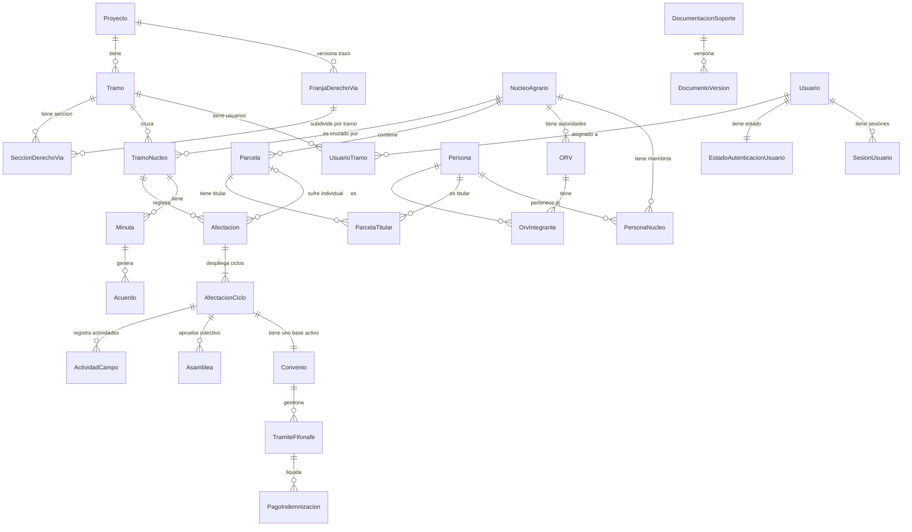
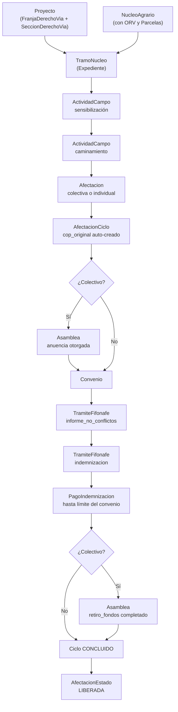
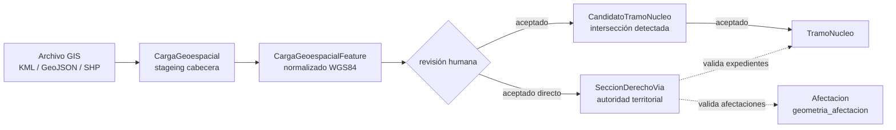

# Arquitectura y Estructura Actual de SOFTWARE-PA

> **Rama de referencia:** `feature/backend-logica`  
> **Migración más reciente registrada:** `030`  
> **Última revisión:** 2026-08-22  
> **Fuente de verdad:** implementación real del repositorio (migraciones SQL, modelos, routers, servicios, frontend y Docker). El presente documento describe únicamente arquitectura **IMPLEMENTADA**.

---

## 0. Correcciones respecto al documento anterior

| Afirmación anterior | Corrección |
|---|---|
| Migraciones aplicadas hasta `028` | El repositorio contiene y aplica hasta `030` |
| `FranjaDerechoVia` tiene `geometria_poligono NOT NULL` | Desde la migración `028`, la franja puede ser lineal O poligonal de forma exclusiva; `geometria_poligono` es nullable |
| Franja se relaciona con `Tramo` (FK `id_tramo`) | Desde la migración `026`, la franja se relaciona con **`Proyecto`** (`id_proyecto`); `id_tramo` pasó a ser nullable (legado) |
| Validación espacial de afectaciones usa `ST_Buffer` sobre `tramo.geometria_linea` | Desde la migración `026`, se valida contra `SeccionDerechoVia.geometria_poligono`; el buffer heredado fue eliminado |
| Una franja activa por tramo | Desde la migración `026`, una franja activa por **proyecto** |
| `vw_tramo_nucleo_estado` y `vw_dashboard_liberacion` definidas en `001_init_schema.sql` | Ambas vistas fueron **redefinidas** completamente en la migración `006` con lógica de ciclos |
| No se documentaban `029` / `030` | Migración `029` (FIFONAFE: requisitos de oficios para informe de no conflictos) y `030` (eliminación de restricción legacy de oficios para indemnización) ya están implementadas |

---

## 1. Estado Actual del Sistema

SOFTWARE-PA es un sistema de gestión de liberación de derecho de vía para proyectos ferroviarios que involucran propiedad social agraria. Gestiona el ciclo completo desde la identificación territorial de núcleos agrarios afectados hasta el pago de indemnizaciones y el cierre registral ante el RAN y FIFONAFE.

**Estado funcional:** Sistema con backend y frontend operativos, autenticación formal, modelo de datos complejo con integridad garantizada por PostgreSQL mediante triggers, vistas derivadas y restricciones compuestas.

---

## 2. Stack Tecnológico

| Capa | Tecnología |
|---|---|
| Base de datos | PostgreSQL 15 + PostGIS 3.3 |
| ORM / Backend | Python 3 + FastAPI + SQLAlchemy 2 |
| Servidor ASGI | Uvicorn |
| Frontend | React (Vite), JSX |
| Mapa | Librería GIS en frontend (componente `Mapa.jsx`) |
| Contenedores | Docker Compose (modo desarrollo y producción) |
| Autenticación | Cookies HTTP-only con tokens SHA-256, CSRF hash, sesiones revocables |
| Migraciones | SQL puro versionado (`schema_migrations`) |
| GIS ingesta | GDAL vía `gis_ingestion.py` |

---

## 3. Arquitectura General

El sistema se organiza en dos grandes dimensiones que confluyen en la entidad expediente (`tramo_nucleo`):

```
DIMENSIÓN TERRITORIAL                    DIMENSIÓN AGRARIA
      Proyecto                          EntidadFederativa
         │                                      │
         ▼                                      ▼
 FranjaDerechoVia                           Municipio
 (trazo oficial versión.)                       │
         │                                      ▼
         ▼                               NucleoAgrario ──► ORV / Integrantes
    [por proyecto]                              │
         │                                      ▼
       Tramo                                Parcela
         │                                  (Titular)
         ▼
 SeccionDerechoVia
 (polígono por tramo)
         │
         └────────────────┐  ┌──────────────────┘
                          ▼  ▼
              TramoNucleo  (Expediente Base)
                          │
                          ▼
                      Afectacion
                          │
                          ▼
                   AfectacionCiclo
                          │
          ┌───────────────┼────────────────┐
          ▼               ▼                ▼
  ActividadCampo      Asamblea         Convenio
                                          │
                                          ▼
                                   TramiteFifonafe
                                  ├── informe_no_conflictos
                                  └── indemnizacion
                                          │
                                          ▼
                                  PagoIndemnizacion
```

---

## 4. Arquitectura de Despliegue / Docker

### Servicios (docker-compose.yml)

| Servicio | Imagen | Puerto expuesto | Descripción |
|---|---|---|---|
| `db` | `postgis/postgis:15-3.3` | `127.0.0.1:5433:5432` | PostgreSQL + PostGIS. Init automático con `001_init_schema.sql` |
| `pgadmin` | `dpage/pgadmin4` | `127.0.0.1:5050:80` | Administración web de DB (solo desarrollo) |
| `backend` | `software-pa-backend` | `127.0.0.1:8000:8000` | FastAPI/Uvicorn |
| `alertas_scheduler` | `software-pa-backend` | — | Job periódico de alertas (`app.jobs.alertas_scheduler`) |
| `frontend` | build local | Varía | React/Vite |

### Modos de despliegue

- **Desarrollo** (`docker-compose.override.yml`): hot-reload con `--reload`, bind mounts, frontend en puerto 5173.
- **Producción** (`docker-compose.prod.yml`): sin bind mounts, `APP_ENV=production`, `AUTH_COOKIE_SECURE=true`, frontend servido por Nginx en puerto 80.

### Variables de entorno clave (`.env.example`)

| Variable | Propósito |
|---|---|
| `DB_USER`, `DB_PASSWORD`, `DB_NAME` | Conexión PostgreSQL |
| `SECRET_KEY` | Firma de tokens |
| `AUTH_INACTIVITY_MINUTES`, `AUTH_ABSOLUTE_MINUTES` | Expiración de sesiones |
| `AUTH_LOCK_MINUTES` | Tiempo de bloqueo tras 5 intentos fallidos |
| `IMPORT_MAX_FILE_SIZE_MB` | Límite de archivos geoespaciales |
| `IMPORT_STAGING_BATCH_SIZE`, `IMPORT_CONFIRM_BATCH_SIZE` | Tamaño de lotes de importación |
| `UPLOAD_ROOT` | Directorio de almacenamiento de archivos |

---

## 5. Arquitectura Backend

### Estructura

```
backend/app/
├── main.py           # FastAPI app, routers montados, CORS, middlewares
├── models.py         # Modelos SQLAlchemy (42 clases, 28 heredan AuditableMixin)
├── schemas.py        # Pydantic schemas
├── schemas_cargas_geoespaciales.py
├── schemas_importaciones.py
├── auth.py           # Lógica de autenticación
├── config.py         # Configuración desde env vars
├── database.py       # Engine SQLAlchemy, SessionLocal
├── routers/          # 13 archivos de rutas
└── services/         # 17 archivos de lógica de negocio
```

### Routers implementados

| Router | Descripción |
|---|---|
| `authentication.py` | Login, logout, sesiones |
| `administration.py` | Gestión de usuarios, tramos, proyectos, núcleos |
| `flujo.py` | Expedientes (tramo_nucleo), afectaciones, ciclos, asambleas, convenios, FIFONAFE |
| `pagos.py` | Pagos de indemnización |
| `documentos.py` | Documentación soporte y versiones |
| `minutas.py` | Minutas y acuerdos |
| `personas.py` | Personas, ORV, integrantes, parcelas, titulares |
| `franjas.py` | Franja de derecho de vía |
| `cargas_geoespaciales.py` | Motor de staging geoespacial genérico |
| `importaciones_geoespaciales.py` | Importador de núcleos agrarios |
| `importaciones_territoriales.py` | Importación territorial |
| `alertas.py` | Alertas del sistema |

### Servicios implementados

| Servicio | Descripción |
|---|---|
| `access.py` | RBAC territorial por `usuario_tramo` |
| `authentication.py` | Verificación de credenciales, gestión de sesiones y bloqueos |
| `administration.py` | Lógica de administración territorial |
| `afectaciones.py` | Lógica de afectaciones (colectivas e individuales) |
| `flujo.py` | Ciclos, asambleas, convenios, FIFONAFE |
| `pagos.py` | Pagos de indemnización |
| `documentos.py` | Versionado documental, SHA-256 |
| `franjas.py` | Franja y secciones de derecho de vía |
| `cargas_geoespaciales.py` | Staging, validación y confirmación geoespacial genérica |
| `importaciones_territoriales.py` | Importador territorial de núcleos |
| `importador_geoespacial.py` | Motor GDAL, normalización WGS84, detección de candidatos |
| `gis_ingestion.py` | Utilidades GIS |
| `nucleos.py` | Gestión de núcleos agrarios |
| `personas.py` | Personas, ORV, parcelas |
| `minutas.py` | Minutas y acuerdos |
| `common.py` | Utilidades comunes |

---

## 6. Arquitectura Frontend

### Páginas implementadas (`frontend/src/pages/`)

| Página | Descripción |
|---|---|
| `Login.jsx` | Autenticación |
| `Dashboard.jsx` | Panel principal con indicadores de liberación |
| `ExpedientesList.jsx` | Lista de expedientes (tramo-núcleo) |
| `ExpedienteDetail.jsx` | Detalle del expediente con flujo completo |
| `AfectacionSubexpediente.jsx` | Vista de afectación individual |
| `FormAfectacionColectiva.jsx` | Formulario de afectación colectiva |
| `FormAfectacionIndividual.jsx` | Formulario de afectación individual |
| `FormAsamblea.jsx` | Formulario de asamblea |
| `FormConvenio.jsx` | Formulario de convenio |
| `AdministracionTerritorial.jsx` | Administración de proyectos, tramos, núcleos |
| `AdministracionUsuarios.jsx` | Gestión de usuarios |
| `ImportacionesGeoespaciales.jsx` | Importación y revisión de datos GIS |
| `Mapa.jsx` | Visualización geoespacial interactiva |

### Estructura de directorios frontend

```
frontend/src/
├── App.jsx           # Rutas, layout global
├── main.jsx
├── index.css
├── api/              # Clientes HTTP por dominio
├── components/       # Componentes reutilizables
├── contexts/         # Estado global (auth, etc.)
├── pages/            # Páginas / vistas
└── utils/            # Utilidades
```

---

## 7. Arquitectura de Base de Datos

### Cadena de Migraciones

| Migración | Descripción |
|---|---|
| `001` | Esquema base: entidades territoriales, proyecto, tramo, núcleo, expediente, afectaciones, convenios, FIFONAFE, documentación, alertas, auditoría, baja lógica |
| `002` | Correcciones de auditoría |
| `003` | Agrega `Proyecto`, elimina `Frente` |
| `004` | Agrega `Persona`, `PersonaNucleo`, `PersonaFuenteLegacy`, `OrvIntegrante`, `ParcelaTitular`, `Minuta`, `Acuerdo`, `DocumentoVersion`, `PagoIndemnizacion` |
| `005` | Integridad estricta de afectaciones colectivas/individuales |
| `006` | `AfectacionCiclo`, vistas derivadas (`vw_afectacion_ciclo_estado`, `vw_afectacion_estado`, `vw_tramo_nucleo_estado`, `vw_dashboard_liberacion`), flujo de pagos por ciclo |
| `007` | Navegación documental por afectación/ciclo en `Minuta` |
| `008` | Autenticación formal: `SesionUsuario`, `EstadoAutenticacionUsuario`, `EventoAcceso` |
| `009` | Auditoría de sistema y sesiones |
| `010` | `FranjaDerechoVia` (poligonal, relacionada con `Tramo`) — **[PROVISIONAL/LEGACY]** |
| `011` | Validación de pago suficiente al completar trámite FIFONAFE |
| `012` | Regularización Corte 5: integridad de franja y relaciones geoespaciales |
| `013` | Auditoría e integridad de franja |
| `014` | Auditoría e integridad de núcleo |
| `015` | Administración territorial: jerarquía padre-hijo activa, protección de baja con dependencias, último admin |
| `016` | Corrección de trigger de geometría padre |
| `017` | Importación territorial de GeoJSON |
| `018` | Unicidad de nombre de núcleo en importación |
| `019` | Franja activa como autoridad territorial: validación de intersección franja↔tramo y franja↔núcleo |
| `020` | Importador geoespacial seguro: `ImportacionArchivo`, `ImportacionFeature`, `PerfilMapeoImportacion`, `CatalogoAliasTerritorial` |
| `021` | Alcance de identidad externa |
| `022` | Identidad externa territorial resuelta |
| `023` | Procedencia y conversión geoespacial |
| `024` | Archivado de importaciones |
| `025` | Staging geoespacial genérico: `CargaGeoespacial`, `CargaGeoespacialFeature`, `CandidatoTramoNucleo` |
| `026` | Franja relacionada con **`Proyecto`** (no con `Tramo`); crea `SeccionDerechoVia`; actualiza validación espacial de afectaciones |
| `027` | Permite tipo `trazo` en `carga_geoespacial.tipo_geometria_esperado` |
| `028` | `FranjaDerechoVia` puede ser lineal (`MULTILINESTRING`) O poligonal (`MULTIPOLYGON`), exclusivas; elimina anchos implícitos |
| `029` | FIFONAFE: requisitos de resultado y oficios para `informe_no_conflictos` completado (EXPAND) |
| `030` | FIFONAFE: elimina restricción legacy de oficios para `indemnizacion` (SWITCH) |

### Inventario de Tablas por Tipo

#### Maestras / Catálogos

| Tabla | Descripción |
|---|---|
| `entidad_federativa` | Estados de la república |
| `municipio` | Municipios vinculados a entidad |
| `proyecto` | Proyecto de infraestructura (raíz) |
| `tramo` | Subdivisión operativa del proyecto |
| `nucleo_agrario` | Ejido o comunidad agraria |
| `persona` | Identidad normalizada de individuos |

#### Geoespaciales

| Tabla | Geometría | Descripción |
|---|---|---|
| `tramo` | `geometria_linea MULTILINESTRING` | **[PROVISIONAL/LEGACY]** Trazo heredado del tramo; reemplazado operativamente por `franja_derecho_via` y `seccion_derecho_via` |
| `franja_derecho_via` | `geometria_linea MULTILINESTRING` XOR `geometria_poligono MULTIPOLYGON` | Trazo oficial versionado por **Proyecto**. Exclusiva: exactamente una de las dos geometrías debe estar presente (migración 028) |
| `seccion_derecho_via` | `geometria_poligono MULTIPOLYGON` | Polígono de derecho de vía asignado explícitamente a un **Tramo** dentro de una Franja. **Autoridad territorial operativa** |
| `nucleo_agrario` | `geometria_poligono MULTIPOLYGON` | Linderos generales del núcleo |
| `parcela` | `geometria_poligono MULTIPOLYGON` | Linderos individuales de parcela |
| `tramo_nucleo` | `geometria_segmento MULTILINESTRING` | Segmento lineal del eje que cruza el núcleo |
| `afectacion` | `geometria_afectacion GEOMETRY(Geometry,4326)` | Polígono/MultiPolígono de la superficie afectada real |

#### Expediente y Flujo Operativo

| Tabla | Tipo | Descripción |
|---|---|---|
| `tramo_nucleo` | Expediente | Cruce entre Tramo y Núcleo. Entidad pivote |
| `afectacion` | Transaccional | Superficie afectada; colectiva o individual |
| `afectacion_ciclo` | Transaccional | Ciclo de negociación de una afectación |
| `actividad_campo` | Evento | Sensibilización y caminamiento de campo |
| `asamblea` | Evento | Asamblea de información/anuencia/retiro de fondos |
| `convenio` | Transaccional | Contrato de liberación con montos y superficies |
| `tramite_fifonafe` | Transaccional | Gestión institucional ante FIFONAFE |
| `pago_indemnizacion` | Financiero | Dispersión real de dinero |

#### Documental

| Tabla | Descripción |
|---|---|
| `documentacion_soporte` | Relación polimórfica de documentos (nucleo, tramo_nucleo, afectacion, convenio, orv) |
| `documento_version` | Versiones de archivo con hash SHA-256 e inmutabilidad |
| `minuta` | Minuta de reunión de campo |
| `acuerdo` | Compromiso derivado de una minuta |

#### Autorización y Seguridad

| Tabla | Descripción |
|---|---|
| `usuario` | Cuenta de usuario; roles: `admin`, `operador`, `visualizador`, `geografo` |
| `usuario_tramo` | RBAC territorial: asignación usuario↔tramo |
| `sesion_usuario` | Sesión activa con token y CSRF hash |
| `estado_autenticacion_usuario` | Conteo de intentos fallidos y bloqueos |
| `evento_acceso` | Log inmutable de eventos de autenticación |

#### Histórico / Padrón Agrario

| Tabla | Descripción |
|---|---|
| `padron_historial` | Historial de padrón de ejidatarios/comuneros |
| `orv` | Órgano de Representación Vecinal con vigencia |
| `orv_integrante` | Integrantes del ORV vinculados a `Persona` |
| `parcela_titular` | Titulares de parcela vinculados a `Persona` |
| `persona_nucleo` | Calidad agraria de una persona en un núcleo |

#### Staging / Importación Geoespacial

| Tabla | Descripción |
|---|---|
| `carga_geoespacial` | Cabecera de carga geoespacial genérica (tramo, franja, sección, núcleo, parcela) |
| `carga_geoespacial_feature` | Feature individual normalizada a WGS84 |
| `candidato_tramo_nucleo` | Intersección detectada automáticamente entre sección y núcleo, pendiente de resolución |
| `importacion_archivo` | Cabecera de importación territorial de núcleos (KML/GeoJSON) |
| `importacion_feature` | Feature individual del importador territorial |
| `perfil_mapeo_importacion` | Perfil de mapeo de campos externos a internos |
| `catalogo_alias_territorial` | Alias aprobados de municipios en fuentes externas |

#### Auditoría

| Tabla | Descripción |
|---|---|
| `bitacora` | Log de INSERT/UPDATE de todas las entidades operativas |
| `alertas` | Alertas generadas (vencimiento ORV, documentos faltantes) |
| `alertas_vistas` | Control de alertas vistas por usuario |

#### Legacy [PROVISIONAL/LEGACY]

| Columna / Tabla | Estado |
|---|---|
| `tramo.geometria_linea` | Legado; reemplazado por `franja_derecho_via` + `seccion_derecho_via` |
| `tramo.ancho_total_derecho_via_m` | Sin DEFAULT desde migración 026; sin uso operativo; datos históricos conservados |
| `franja_derecho_via.id_tramo` | Nullable desde migración 026; relación principal ahora es con `Proyecto` |
| `orv.comisariado_*`, `orv.consejo_vigilancia_*` | Columnas de texto legacy; usar `orv_integrante` + `persona` |
| `parcela.nombre_titular` | Columna de texto legacy; usar `parcela_titular` + `persona` |
| `documentacion_soporte.url_archivo` | Legacy; usar `documento_version.ruta_almacenamiento` |
| `persona_fuente_legacy` | Trazabilidad de migración de nombres desde ORV/Parcela a `Persona` |

---

## 8. Modelo Territorial y Geoespacial

### Jerarquía Territorial

```
Proyecto (raíz)
└── FranjaDerechoVia (versión del trazo, por proyecto)
    │   geometria_linea XOR geometria_poligono
    │   una sola franja activa por proyecto
    │   inmutable en geometría y metadatos tras inserción
    └── SeccionDerechoVia (por tramo, dentro de la franja)
            geometria_poligono MULTIPOLYGON
            una sola sección activa por tramo
            debe intersectar la franja
└── Tramo (subdivisión operativa)
    └── SeccionDerechoVia ←→ misma de arriba
```

### Responsabilidades Geoespaciales Actuales

| Entidad | Geometría | Propósito real |
|---|---|---|
| `tramo.geometria_linea` | MULTILINESTRING | **[LEGACY]** Eje heredado del tramo. No usado en validaciones operativas desde migración 026 |
| `franja_derecho_via.geometria_linea` | MULTILINESTRING | Eje lineal del trazo a nivel proyecto (modelo desde migración 028) |
| `franja_derecho_via.geometria_poligono` | MULTIPOLYGON | Franja poligonal a nivel proyecto (alternativa exclusiva al eje lineal) |
| `seccion_derecho_via.geometria_poligono` | MULTIPOLYGON | **Autoridad territorial** del tramo. Superficie operativa explícita |
| `nucleo_agrario.geometria_poligono` | MULTIPOLYGON | Linderos del ejido/comunidad |
| `parcela.geometria_poligono` | MULTIPOLYGON | Linderos individuales de parcela |
| `tramo_nucleo.geometria_segmento` | MULTILINESTRING | Segmento lineal del eje que cruza el núcleo |
| `afectacion.geometria_afectacion` | GEOMETRY (solo POLYGON/MULTIPOLYGON) | Polígono de afectación real; debe intersectar núcleo y sección |

### Reglas de Validación Geoespacial (implementadas por triggers)

1. **Franja activa → Proyecto activo** (trigger `trg_019_franja_coherente`).
2. **Franja inmutable** en geometría, fuente, versión, fechas y anchos tras inserción (`fn_c5_validar_version_franja`).
3. **Franja: geometría exclusiva** → exactamente una de `geometria_linea` o `geometria_poligono` (CHECK `028`).
4. **SeccionDerechoVia** debe pertenecer al mismo proyecto de franja y tramo, e intersectar la franja (`fn_026_validar_seccion_derecho_via`).
5. **TramoNucleo activo** requiere que la sección activa del tramo intersecte con el polígono del núcleo (`fn_019_validar_tramo_nucleo_franja` actualizada en 026).
6. **Afectación** (origen `captura_sistema`) debe intersectar con núcleo **y** con `SeccionDerechoVia` activa del tramo (desde migración 026; antes usaba buffer heredado).
7. Modificar `geometria_poligono` de un núcleo no puede romper relaciones `tramo_nucleo` activas con `geometria_segmento` (trigger migración 015/026).

> **NOTA IMPORTANTE**: La generación automática de derecho de vía mediante `ST_Buffer(geometria_linea, ancho/2)` se utilizó únicamente en la migración `010` para poblar datos históricos de `franja_derecho_via`. Ese mecanismo **no existe** en el flujo operativo actual. Las secciones se cargan explícitamente mediante el importador geoespacial.

### Candidatos Tramo-Núcleo

La tabla `candidato_tramo_nucleo` (migración 025) registra intersecciones detectadas automáticamente entre una `SeccionDerechoVia` y un `NucleoAgrario`. Cada candidato puede ser aceptado (genera un `TramoNucleo`) o rechazado por un usuario con resolución documentada.

---

## 9. Modelo de Expediente y Afectaciones

### TramoNucleo (Expediente)

`TramoNucleo` es el expediente base. Materializa el cruce entre un `Tramo` y un `NucleoAgrario`. Un núcleo afectado por dos tramos distintos genera dos expedientes independientes.

**Restricciones clave:**
- `UNIQUE(id_tramo, consecutivo)`: cada expediente tiene un número único dentro del tramo.
- FK compuesta `(id_nucleo, id_tramo_nucleo)` referenciada por `afectacion`, `asamblea`.
- No puede crearse si el tramo o el núcleo están inactivos.
- No puede darse de baja si tiene afectaciones activas (trigger migración 015).

### Afectacion

Nace de un `TramoNucleo`. Dos tipos mutuamente excluyentes:
- **Colectiva**: `id_parcela IS NULL`; afecta bienes del núcleo (uso común, colectivos).
- **Individual**: `id_parcela IS NOT NULL`; afecta una parcela específica con titular validado.

**Restricciones clave:**
- CHECK `chk_afectacion_tipo_parcela`: colectiva → sin parcela; individual → con parcela.
- FK compuesta doble: `(id_nucleo, id_tramo_nucleo)` y `(id_nucleo, id_parcela)`.
- Solo puede crearse si existe un caminamiento `cop_original` completado (`trg_2b_validar_creacion_afectacion`).
- No puede crearse si la afectación es colectiva y el expediente tiene `proyecto_no_afecta_uso_comun = TRUE`.
- `tipo_salida_terminal`: una vez establecido es irreversible (expropiación o comunidad indígena).
- Geometría restringida a POLYGON/MULTIPOLYGON, SRID 4326, ST_IsValid.

Al crear una `Afectacion`, PostgreSQL crea automáticamente un ciclo `cop_original` (trigger `trg_2b_crear_ciclo_original`).

### AfectacionCiclo

Separa la afectación física del ciclo de negociación. Permite abrir nuevos ciclos (`superficie_adicional`, `obras_complementarias`, `ampliacion`, `ampliacion_remanente`) sin duplicar la entidad física.

**Tipos de ciclo por tipo de afectación:**
- **Colectivo**: `cop_original`, `superficie_adicional`, `obras_complementarias`
- **Individual**: `cop_original`, `ampliacion`, `ampliacion_remanente`

Solo un ciclo `cop_original` activo por afectación. Solo un ciclo activo por tipo+consecutivo.

---

## 10. Flujo Colectivo e Individual

### Secuencia operativa

```
[Expediente TramoNucleo]
         │
         ▼
ActividadCampo tipo="sensibilizacion" (contexto cop_original, sin ciclo)
         │
         ▼
ActividadCampo tipo="caminamiento" (contexto cop_original, sin ciclo) ← requiere sensibilización previa
         │
         ▼ ← PostgreSQL valida caminamiento antes de crear Afectacion
  Afectacion (colectiva o individual)
         │
         ▼ ← PostgreSQL crea automáticamente AfectacionCiclo cop_original
  AfectacionCiclo (cop_original, consecutivo=1)
         │
    ┌────┴────┐
    ▼ (colectivo)
Asamblea tipo="informacion" o "anuencia" → resultado_anuencia="otorgada"
    │
    ▼
Convenio tipo="cop_original" vinculado al ciclo
         │                            │
         ▼ (individual)               │
Convenio tipo="cop_original"          │
         │                            │
         └──────────────┬─────────────┘
                        ▼
               TramiteFifonafe tipo="informe_no_conflictos"
                (completo: requiere resultado + 4 oficios completos)
                        │
                        ▼ ← requiere informe sin conflictos completado
               TramiteFifonafe tipo="indemnizacion"
                (completo: requiere pago >= límite del ciclo)
                        │
                        ▼
               PagoIndemnizacion (uno o varios; no puede exceder límite)
                        │
                        ▼ (solo colectivo)
               Asamblea tipo="retiro_fondos" (completo)
```

### Reglas de secuencia implementadas (triggers migración 006)

| Regla | Trigger |
|---|---|
| Caminamiento requiere sensibilización previa | `fn_2b_validar_actividad` |
| Afectación requiere caminamiento completado | `fn_2b_validar_creacion_afectacion` |
| Afectación con salida terminal → no permite nuevos ciclos | `fn_2b_validar_ciclo` |
| Convenio colectivo requiere asamblea con anuencia otorgada | `fn_2b_validar_convenio` |
| Convenio requiere ciclo activo del tipo correcto | `fn_2b_validar_convenio` |
| FIFONAFE de indemnización requiere informe sin conflictos completado | `fn_2b_validar_fifonafe` |
| FIFONAFE completado no puede regresionar de estado | `fn_2b_validar_fifonafe` |
| Pago no puede exceder límite financiero vigente del ciclo | `fn_validar_pago_indemnizacion` |
| Límite financiero no puede reducirse por debajo de lo ya pagado | `fn_proteger_limite_convenio_pagado` |
| Retiro de fondos (colectivo) requiere indemnización completa | `fn_2b_validar_asamblea` |
| Secuencia registral (RAN): ingreso → inscripción; no regresión | `fn_2b_validar_convenio` |

---

## 11. Ciclos de Afectación y Convenios

### Tipos de convenio por tipo de afectación

| Afectación | Tipos de convenio permitidos |
|---|---|
| Colectivo | `cop_original`, `modificatorio`, `superficie_adicional`, `obras_complementarias` |
| Individual | `cop_original`, `modificatorio`, `ampliacion`, `ampliacion_remanente` |

### Modificatorio

- Requiere `id_convenio_padre` que no sea `modificatorio`.
- En colectivo: el padre debe tener asamblea con anuencia otorgada.
- Montos (`monto_90`, `monto_100`) son obligatorios.
- Colectivo: requiere inscripción RAN del modificatorio antes de activarse como versión financiera vigente.
- Una vez activo el modificatorio como versión financiera (`vigencia_financiera_desde IS NOT NULL` y `vigencia_financiera_hasta IS NULL`), los montos son inmutables.

### Vigencia Financiera del Convenio

Un convenio activo puede tener:
- `vigencia_financiera_desde`: momento en que entra en vigor como límite de pago.
- `vigencia_financiera_hasta`: momento en que es reemplazado por un modificatorio.

Solo un convenio activo con `vigencia_financiera_hasta IS NULL` por ciclo.

---

## 12. RAN, FIFONAFE y Pagos

### Seguimiento Registral (RAN)

Tanto `Asamblea` como `Convenio` tienen seguimiento registral de tres pasos:
1. `ingreso_ran_fecha` / `numero_solicitud_ran` (fecha de ingreso al RAN)
2. `calificacion_registral_ran` / `calificacion_registral` (calificación)
3. `acta_inscripcion_fecha_ran` / `convenio_inscrito_fecha_ran` (inscripción final)

**Regla**: la secuencia es unidireccional y no permite regresión (`fn_2b_validar_convenio`, `fn_validar_regresion_estado_convenio`).

**FIFONAFE requiere convenio inscrito en RAN** antes de crear un trámite de indemnización (`v_convenio.convenio_inscrito_fecha_ran IS NOT NULL`).

**FIFONAFE colectivo** requiere además que la asamblea vinculada al convenio tenga `acta_inscripcion_fecha_ran IS NOT NULL`.

### Trámites FIFONAFE

| Tipo | Descripción | Requisitos para completar |
|---|---|---|
| `informe_no_conflictos` | Verificación de situación de conflictos | `hay_conflictos IS NOT NULL` + 4 oficios completos (migración 029/030) |
| `indemnizacion` | Gestión del pago de la indemnización | Informe sin conflictos completado + pago >= límite del ciclo (migración 011) |

### Pagos

- `PagoIndemnizacion` referencia un trámite de tipo `indemnizacion`.
- Tipos de pago: `anticipo`, `parcial`, `total` (solo un pago `total` activo por trámite).
- Referencia bancaria única por banco+referencia activos.
- El total pagado no puede exceder `monto_100 + monto_bdt` del convenio vigente.
- Dado de baja un convenio con pagos activos: **bloqueado** por trigger.

### Cambio en migración 029/030

Antes (001): `tramite_fifonafe` exigía los 4 oficios para **cualquier** tipo de trámite completado.
Migración 029 (EXPAND): agrega constraint específico para `informe_no_conflictos`.
Migración 030 (SWITCH): elimina la constraint genérica (`chk_estatus_completo_requiere_oficios`).
**Resultado**: los 4 oficios y el resultado de conflictos solo son obligatorios al completar un `informe_no_conflictos`. Los datos históricos de indemnizaciones se conservan sin modificación.

---

## 13. Documentación y Versionado

### Modelo Documental

```
Entidad (nucleo_agrario | tramo_nucleo | afectacion | convenio | orv)
└── DocumentacionSoporte (polimórfico; FK dinámica validada por trigger)
    └── DocumentoVersion (versionado secuencial, SHA-256, inmutable al borrado físico)
```

- `DocumentacionSoporte.entidad_relacionada_tipo` controla el tipo de entidad referenciada.
- No hay FK nativa (relación polimórfica); la integridad se aplica por trigger `trg_validar_documentacion_soporte_referencia`.
- `DocumentoVersion` mantiene `numero_version`, `hash_sha256` (formato `^[0-9a-f]{64}$`), `tamano_bytes`, `ruta_almacenamiento` y `id_usuario_carga`.
- **Borrado físico prohibido** por trigger `trg_prevent_delete_documento_version`.
- Los metadatos de versión (ruta, nombre) pueden actualizarse; no hay inmutabilidad absoluta a nivel PostgreSQL sobre todos los campos.

> **[LEGACY]**: `documentacion_soporte.url_archivo` sigue en el esquema con comentario "LEGACY FASE 2; usar `documento_version.ruta_almacenamiento`".

---

## 14. Usuarios, Roles y Autorización

### Modelo de Autenticación

```
Usuario
├── EstadoAutenticacionUsuario  (intentos fallidos, bloqueo, último acceso)
├── SesionUsuario               (token_hash, csrf_hash, expiración, revocación)
└── EventoAcceso                (log inmutable de todos los eventos de acceso)
```

### Roles

| Rol | Descripción |
|---|---|
| `admin` | Acceso total, gestión de usuarios y asignaciones |
| `operador` | Registro operativo en expedientes y flujo |
| `visualizador` | Solo lectura |
| `geografo` | Operaciones GIS (carga/importación geoespacial) |

### RBAC Territorial

`usuario_tramo` asigna usuarios a tramos específicos. El servicio `services/access.py` implementa filtros por tramos asignados en endpoints de flujo, pagos, dashboard, reportes, tramo-núcleos, afectaciones, documentación, franjas y cargas geoespaciales.

> **Límite conocido**: El control territorial no está reforzado por Row Level Security (RLS) en PostgreSQL. Endpoints de personas, parcelas, ORV e integrantes validan rol pero no aplican sistemáticamente filtro territorial.

### Sesiones y Bloqueo

- 5 intentos fallidos consecutivos → bloqueo por `AUTH_LOCK_MINUTES` minutos.
- Sesiones tienen expiración por inactividad (`AUTH_INACTIVITY_MINUTES`) y expiración absoluta (`AUTH_ABSOLUTE_MINUTES`).
- La baja de un usuario revoca automáticamente todas sus sesiones activas.
- `EventoAcceso` es inmutable (trigger `trg_008_evento_inmutable`; BEFORE UPDATE OR DELETE).

---

## 15. Auditoría y Baja Lógica

### Baja Lógica Universal

Todas las entidades operativas tienen el patrón:
```sql
activo BOOLEAN NOT NULL DEFAULT TRUE,
fecha_baja TIMESTAMPTZ,
id_usuario_baja INTEGER,
motivo_baja TEXT,
fecha_reactivacion TIMESTAMPTZ,
id_usuario_reactivacion INTEGER,
motivo_reactivacion TEXT,
observaciones TEXT
```

**Trigger `fn_validar_baja_logica`** (aplicado a todas las tablas): al pasar `activo` de `TRUE` a `FALSE`, exige `fecha_baja`, `id_usuario_baja` y `motivo_baja`. Al reactivar, exige los campos de reactivación.

### Protección contra DELETE Físico

**Trigger `fn_prevent_physical_delete`** aplicado a todas las tablas operativas: lanza excepción `'Borrado físico prohibido por auditoría. Use UPDATE activo = FALSE'`.

### Bitácora de Auditoría

`fn_audit_log` (trigger AFTER INSERT OR UPDATE) registra en `bitacora`:
- Usuario (`app.current_user_id` debe estar establecido en la transacción).
- Entidad y PK.
- Valores anterior y nuevo en JSONB.
- Campos sensibles (`contrasena_hash`, `token_hash`, `csrf_hash`) son excluidos del snapshot desde migración 008.

### Protecciones de Jerarquía

| Restricción | Trigger |
|---|---|
| No bajar Proyecto con tramos activos | `trg_015_proyecto_sin_hijos_activos` |
| No bajar Tramo con franjas/expedientes/usuarios activos | `trg_015_tramo_sin_hijos_activos` |
| No bajar Núcleo con expedientes activos | `trg_015_nucleo_sin_hijos_activos` |
| No bajar Usuario con asignaciones activas | `trg_015_usuario_sin_asignaciones` |
| No bajar la última cuenta admin activa | `trg_015_ultimo_admin` |
| No inactivar Parcela con afectación individual activa | `trg_2a_proteger_parcela_referenciada` |
| No bajar Convenio con pagos activos | `fn_proteger_limite_convenio_pagado` |

---

## 16. Estados Derivados y Vistas

> **Los estados de liberación NO son campos almacenados**. Son calculados en tiempo de consulta por vistas de PostgreSQL. No existe ninguna columna editable manualmente de "estado de liberación".

### Vistas derivadas (migración 006 — versión vigente)

#### `vw_afectacion_ciclo_estado`

Calcula por cada ciclo activo:

| Campo derivado | Descripción |
|---|---|
| `estado_operativo` | `convenio_pendiente` / `convenio_pendiente_firma` / `convenio_firmado` |
| `estado_registral` | `no_iniciado` / `ingresado_ran` / `inscrito_ran` |
| `estado_financiero` | `informe_no_conflictos_pendiente` / `indemnizacion_pendiente` / `retiro_fondos_pendiente` / `concluido` / `no_aplica_terminal` |
| `superficie_ciclo_ha` | Superficie del ciclo (de convenio o ciclo base) |
| `saldo_disponible` | `MAX(limite_pagable - total_pagado, 0)` |

#### `vw_afectacion_estado`

Agrega todos los ciclos de una afectación:

| Campo derivado | Descripción |
|---|---|
| `estado_liberacion` | `pendiente` / `en_proceso` / `liberada` / `no_aplica_terminal` |
| `estado_registral` | `no_iniciado` / `ingresado_ran` / `con_avance_registral` |
| `estado_financiero` | `no_iniciado` / `en_proceso` / `concluido` |
| `superficie_liberada_ha` | Suma de superficies de ciclos concluidos |

#### `vw_tramo_nucleo_estado`

Agrega todas las afectaciones de un expediente:

| Campo derivado | Descripción |
|---|---|
| `estado_legal` | `pendiente` / `en_proceso` / `liberado` / `fuera_seguimiento` / `mixto` |
| `estado_geoespacial` | `pendiente_digitalizacion` / `completo` |
| `tiene_anuencia` | ¿Existe asamblea con anuencia otorgada? |
| `tiene_convenio_inscrito_ran` | ¿Existe convenio inscrito en RAN? |

#### `vw_dashboard_liberacion`

Vista de resumen ejecutivo por expediente, incluyendo:
- Porcentaje de avance legal y geoespacial.
- Superficies afectadas, liberadas y pendientes.
- Total de convenios formalizados ante RAN (colectivos e individuales).

#### `vw_orv_estado`

Vista simple: `orv.*` + `orv_vigente BOOLEAN` calculado de `CURRENT_DATE BETWEEN inicio_vigencia AND fin_vigencia`.

> **Nota**: `vw_tramo_nucleo_estado` y `vw_dashboard_liberacion` fueron redefinidas completamente en la migración `006`. La versión de `001_init_schema.sql` quedó sustituida y usa lógica de ciclos, no la lógica simplista original.

---

## 17. Integridad y Reglas de Negocio

### Restricciones de Superficie

| Regla | Mecanismo |
|---|---|
| Suma de superficies liberadas no puede exceder superficie afectada | `trg_validar_superficie_liberada_convenio` (AFTER INSERT/UPDATE en convenio) |
| Superficie afectada no puede reducirse por debajo de lo ya liberado | `trg_validar_superficie_afectada_reducida` (BEFORE UPDATE en afectacion) |
| Convenios de superficie adicional/ampliación sincronizan `superficie_afectada_ha` | `trg_sincronizar_superficie_adicional` |

### Restricciones Financieras

| Regla | Mecanismo |
|---|---|
| Pago no puede exceder límite del ciclo | `fn_validar_pago_indemnizacion` (migración 006) |
| Modificar montos de convenio vigente es inmutable si hay pagos | `fn_2b_validar_convenio` |
| Completar indemnización requiere pago suficiente | `fn_2b_validar_fifonafe` (migración 011) |
| No bajar convenio con pagos activos | `fn_proteger_limite_convenio_pagado` |

### Restricciones Agrarias

| Regla | Mecanismo |
|---|---|
| Modificatorio colectivo requiere asamblea padre con anuencia | `fn_validar_modificatorio_colectivo` |
| Caminamiento requiere sensibilización previa | `fn_2b_validar_actividad` |
| No se crean convenios en expediente marcado como expropiación | `trg_validar_convenio_expropiacion` |
| No se crean afectaciones colectivas si `proyecto_no_afecta_uso_comun` | `trg_validar_afectacion_uso_comun` |

### Restricciones de Parcela Individual

| Regla | Mecanismo |
|---|---|
| Parcela individual requiere `no_parcela_ppt` | `fn_validar_parcela_para_afectacion` (migración 005) |
| Parcela individual requiere soporte/justificación registral | ídem |
| Copropiedad requiere al menos 2 titulares activos | ídem |
| Titular activo de persona vinculada a parcela de afectación individual | `trg_2a_revalidar_titulares_parcela` |

### Restricciones Documentales

| Regla | Mecanismo |
|---|---|
| `documentacion_soporte` referencia entidad activa existente | `trg_validar_documentacion_soporte_referencia` |
| Tipos de entidad documental limitados | CHECK `chk_2c_documentacion_entidad_tipo` |

### Restricciones de Unicidad Relevantes

| Entidad | Restricción |
|---|---|
| `usuario` | Correo único normalizado (minúsculas, sin espacios) |
| `nucleo_agrario` | Por fuente: `(lower(fuente_datos), id_nucleo_fuente)` únicos activos |
| `orv_integrante` | Un solo integrante activo por cargo en un ORV |
| `pago_indemnizacion` | Un solo pago tipo `total` activo por trámite |
| `franja_derecho_via` | Una franja activa por proyecto; versiones únicas por proyecto |
| `seccion_derecho_via` | Una sección activa por tramo; FK única `(id_franja, id_tramo)` |
| `afectacion_ciclo` | Un solo ciclo `cop_original` activo por afectación |
| `convenio` | Un convenio base activo por ciclo (no modificatorio) |
| `tramite_fifonafe` | Un trámite activo por tipo por ciclo |
| `candidato_tramo_nucleo` | Único por `(id_seccion, id_nucleo)` |

---

## 18. Importadores y Procedencia Geoespacial

### Motor de Staging Geoespacial Genérico (migración 025)

Para cargar geometrías de tramos, franjas, secciones, núcleos y parcelas:

```
Archivo (KML / GeoJSON / Shapefile)
    ↓
carga_geoespacial (cabecera: tipo_objetivo, formato, SHA-256, estado)
    ↓
carga_geoespacial_feature (normalización WGS84, ST_MakeValid, validación)
    ↓ (revisión humana)
candidato_tramo_nucleo (intersección detectada)  ←  solo para tipo franja/sección
    ↓ (aceptado por usuario)
TramoNucleo / SeccionDerechoVia / NucleoAgrario / Parcela (entidad operativa)
```

**Estados de carga:** `subido` → `prevalidando` → `listo_revision` → `confirmado` / `cancelado` / `fallido`

**Tipos de objetivo permitidos (desde migración 027):** `tramo`, `franja_derecho_via`, `seccion_derecho_via`, `nucleo_agrario`, `parcela`

**Tipos de geometría esperados:** `linea`, `poligono`, `trazo`

### Importador Territorial de Núcleos (migración 020)

Para importar núcleos agrarios desde archivos KML/GeoJSON de fuentes externas (RAN, SIGCA, etc.):

```
Archivo KML/GeoJSON
    ↓
importacion_archivo (cabecera con SHA-256, perfil de mapeo, estado)
    ↓
importacion_feature (feature normalizada, atributos, territorio resuelto)
    ↓ (revisión y confirmación)
nucleo_agrario (entidad operativa con trazabilidad a fuente)
```

**Componentes de soporte:**
- `perfil_mapeo_importacion`: define cómo mapear campos externos a internos.
- `catalogo_alias_territorial`: alias aprobados de nombres de municipios en fuentes externas.
- `nucleo_agrario.fuente_datos`, `id_nucleo_fuente`: trazabilidad de origen en el núcleo importado.

### Job de Alertas

`alertas_scheduler` (servicio Docker independiente): genera automáticamente alertas de vencimiento de ORV, documentos faltantes y eventos próximos. Configurado con `ALERTAS_INTERVAL_SECONDS` (por defecto 86400 segundos = 1 día).

---

## 19. Componentes Legacy / Deuda Técnica Existente

| Componente | Estado | Descripción |
|---|---|---|
| `tramo.geometria_linea` | **LEGACY** | Eje heredado, no usado en validaciones operativas desde migración 026 |
| `tramo.ancho_total_derecho_via_m` | **LEGACY** | Sin DEFAULT, sin uso en cálculos. Datos históricos conservados |
| `franja_derecho_via.id_tramo` | **LEGACY** | Nullable; la relación principal es con `id_proyecto` |
| `franja_derecho_via.ancho_izquierdo_m` / `ancho_derecho_m` | **LEGACY** | Campos de anchos sin uso operativo; datos históricos de migración 010 |
| Columnas de texto en `orv` (`comisariado_*`, `consejo_vigilancia_*`) | **LEGACY** | Comentadas como "usar `orv_integrante`"; pendiente migración CONTRACT |
| `parcela.nombre_titular` | **LEGACY** | Comentada como "usar `parcela_titular`"; pendiente migración CONTRACT |
| `documentacion_soporte.url_archivo` | **LEGACY** | Comentada como "usar `documento_version.ruta_almacenamiento`"; pendiente CONTRACT |
| `persona_fuente_legacy` | **PROVISIONAL** | Trazabilidad de migración de texto a entidades; útil hasta depuración completa |
| `vw_tramo_nucleo_estado` (versión 001) | **SUSTITUIDA** | Redefinida en migración 006 con lógica de ciclos |
| `vw_dashboard_liberacion` (versión 001) | **SUSTITUIDA** | Redefinida en migración 006 |

---

## 20. Límites Actuales de la Arquitectura

1. **Sin RLS en PostgreSQL**: el control de acceso territorial depende exclusivamente del backend; una conexión directa a la DB no está restringida por usuario.
2. **RBAC territorial parcial**: endpoints de personas, ORV, parcelas e integrantes no aplican filtro territorial sistemático.
3. **`usuario_tramo`**: existe en el esquema y el backend lo usa, pero puede no tener asignaciones activas, resultando en datasets vacíos para usuarios no admin.
4. **`ActividadCampo`** puede existir con `id_ciclo_afectacion = NULL` (antecedentes compartidos del contexto `cop_original`); no todo trabajo de campo cuelga estrictamente de un ciclo.
5. **`DocumentoVersion`**: protegido contra borrado físico, pero no es completamente inmutable a nivel PostgreSQL (metadatos de versión pueden actualizarse).
6. **Migración CONTRACT pendiente**: las columnas legacy de ORV, Parcela y `documentacion_soporte.url_archivo` no han sido eliminadas aún.
7. **Candidatos `tramo_nucleo`**: el proceso de detección automática mediante `candidato_tramo_nucleo` aún requiere revisión y resolución humana; no hay generación automática de expedientes.
8. **Sin auditoría de SELECT**: la bitácora solo registra INSERT y UPDATE, no consultas de lectura.
9. **Franja inmutable**: una franja es inmutable en su geometría tras inserción; modificar el trazo del proyecto requiere insertar una nueva versión (y el sistema bloquea la nueva versión si rompe relaciones de expedientes activos).

---

## 21. Diagrama General de Arquitectura

### Diagrama ER Principal



### Diagrama de Flujo de Liberación



### Diagrama de la Capa Geoespacial


