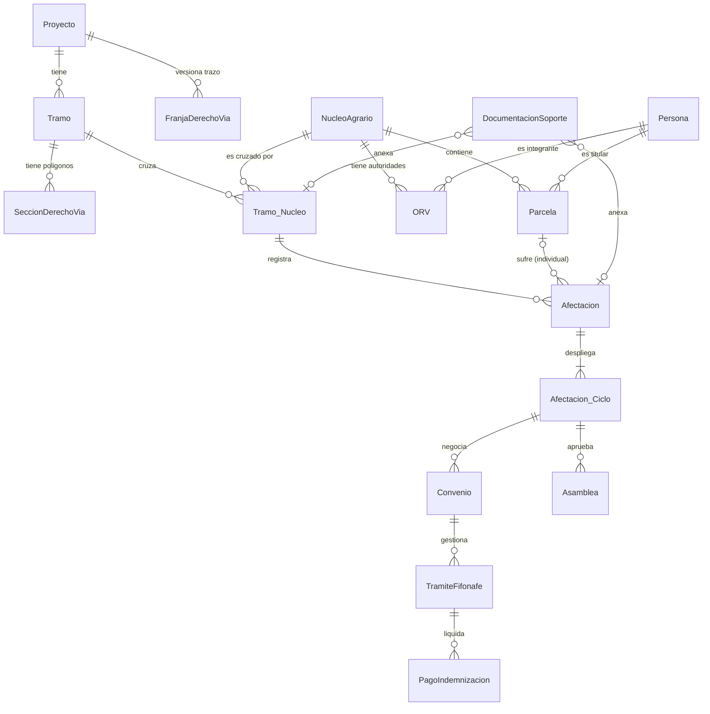

# Arquitectura y Estructura Actual de SOFTWARE-PA

Este documento describe la arquitectura funcional y técnica **real** que opera actualmente en el sistema, contrastada contra la base de datos PostgreSQL/PostGIS activa, migraciones aplicadas, modelos SQLAlchemy y backend vigente.

> **Alcance:** esta fotografía corresponde a la base activa `db_pruebas_alfredo`, con migraciones registradas hasta `028`. Las migraciones presentes en el repositorio pero no registradas en `schema_migrations` no se consideran aplicadas por sí mismas.

---

## 1. Fuente de Verdad

- **Base de datos activa:** PostgreSQL 15.4 + PostGIS 3.3.4 (`db_pruebas_alfredo`).
- **Migración aplicada más reciente:** `028`.
- **Modelos:** 42 clases SQLAlchemy heredan de `Base`; 28 de ellas heredan también de `AuditableMixin`.
- **Triggers:** El sistema depende fuertemente de PostgreSQL para bitácora automática, prevención de borrado físico, baja lógica y varias validaciones espaciales, documentales, financieras y de flujo.
- **Límite importante:** no existe evidencia de RLS en PostgreSQL; el control territorial se aplica principalmente en backend.

## 2. Jerarquía Principal

El sistema representa la convergencia de dos grandes dimensiones (Territorial y Agraria) que colisionan en una entidad pivote (`Tramo_Nucleo`), a partir de la cual nace todo el flujo operativo de liberación.

```text
DIMENSIÓN TERRITORIAL                     DIMENSIÓN AGRARIA
      Proyecto                           Entidad Federativa
         │                                       │
         ▼                                       ▼
  FranjaDerechoVia                           Municipio
  (Versiones Trazo)                              │
         │                                       ▼
         ▼                                 NucleoAgrario  ──► ORV (Representantes)
       Tramo                                     │
         │                                       │
         ▼                                       ▼
 SeccionDerechoVia                       Parcela (Opcional)
 (Polígonos espaciales)                          │
         │                                       │
         └─────────────────┐   ┌─────────────────┘
                           ▼   ▼
               Tramo_Nucleo (Expediente Base)
                           │
                           ▼
                       Afectacion
                           │
                           ▼
                    Afectacion_Ciclo
                           │
                           ▼
         Flujo Operativo, Jurídico y Financiero
```

## 3. Modelo Territorial

```text
Proyecto
└── FranjaDerechoVia (Versiones oficiales del trazo del Proyecto)
└── Tramo
    └── SeccionDerechoVia (Polígonos operativos delegados al Tramo)
```
- **`Proyecto`**: Raíz absoluta de la infraestructura (ej. "Tren Maya").
- **`FranjaDerechoVia`**: Representa el trazo oficial versionado a nivel Proyecto. En la base activa las franjas cargadas usan geometría lineal (`geometria_linea`), pero el esquema permite exactamente una de dos formas: `geometria_linea` (`MULTILINESTRING`) o `geometria_poligono` (`MULTIPOLYGON`). PostgreSQL protege la versión con triggers de inmutabilidad y una única franja activa por proyecto.
- **`Tramo`**: Subdivisión administrativa y operativa del proyecto (ej. "Tramo 7").
- **`SeccionDerechoVia`**: Geometría poligonal exacta (`MULTIPOLYGON`) que le corresponde a un Tramo específico derivada de una versión de la Franja. Es la autoridad territorial.

## 4. Modelo Agrario

```text
Entidad Federativa
└── Municipio
    └── Nucleo Agrario
        ├── ORV (Órganos de Representación Vecinal)
        │   └── Orv_Integrante (Persona)
        │
        └── Parcela (Para afectaciones individuales)
            └── Parcela_Titular (Persona)
```
- **`Nucleo Agrario`**: Entidad social y geográfica (Ejido o Comunidad). La unicidad vigente aplica sobre registros activos por `(municipio, tipo_nucleo, nombre normalizado)`.
- **`ORV` / `Orv_Integrante`**: Manejan la vigencia de las autoridades del núcleo, con un motor de alertas automáticas por vencimiento.
- **`Persona`**: Tabla centralizada que normaliza la identidad de individuos, conectándose a núcleos, ORVs y parcelas.

## 5. Modelo de Expedientes y Afectaciones

```text
Tramo_Nucleo
├── Bitacora (Historial de cambios)
├── DocumentacionSoporte (Documentos Polimórficos)
└── Afectacion (La "tierra" afectada, colectiva o individual)
    └── Afectacion_Ciclo (El "esfuerzo" de liberación financiera)
```
- **`Tramo_Nucleo`**: Es el **Expediente**. Es la entidad que materializa el cruce entre un segmento de la obra (Tramo) y una propiedad social (Núcleo Agrario). Un núcleo afectado por dos tramos distintos tiene dos expedientes independientes.
- **`Afectacion`**: Nace de un `Tramo_Nucleo`. Puede ser **colectiva** (apunta solo al núcleo) o **individual** (requiere obligatoriamente un FK a `Parcela`).
- **`Afectacion_Ciclo`**: Separa la afectación física del ciclo de negociación. Si una negociación original se queda corta y requiere más tierra, se abre un nuevo ciclo sobre la misma Afectación sin duplicar la entidad física. PostgreSQL crea automáticamente el ciclo `cop_original` al insertar una `Afectacion`.

## 6. Flujo Jurídico y Financiero

El trabajo jurídico y financiero vigente cuelga del **Ciclo de Afectación**. El trabajo de campo tiene un matiz: `ActividadCampo` puede tener `id_ciclo_afectacion = NULL` para antecedentes compartidos del contexto `cop_original`.

```text
Afectacion_Ciclo
├── ActividadCampo (Visitas, sensibilización, mediciones)
├── Asamblea (Aprobaciones sociales, anuencias)
├── Convenio (El contrato jurídico con montos y superficies)
│   └── TramiteFifonafe (Gestión de fondos institucionales)
│       └── PagoIndemnizacion (Dispersión real de dinero)
└── Minuta (Registro de acuerdos de campo)
    └── Acuerdo (Compromisos con responsables y fechas)
```
> **Invariante crítico:** PostgreSQL bloquea completar un trámite FIFONAFE de `indemnizacion` si el total pagado del ciclo es menor al límite financiero vigente del convenio. También bloquea pagos que excedan el límite y modificaciones de convenio que dejen el límite por debajo de lo ya pagado. Esta regla no significa que cada pago individual deba cubrir el convenio completo.

## 7. Modelo Geoespacial (Implementación Real)

La geometría reside en PostgreSQL procesada con PostGIS (`EPSG:4326`).

| Entidad | Geometría | Tipo | Propósito (Uso Real) |
| ------- | --------- | ---- | --------- |
| `Tramo` | `geometria_linea` | MULTILINESTRING | *Legacy*. Reemplazado operativamente por Franja/Sección. |
| `FranjaDerechoVia` | `geometria_linea` | MULTILINESTRING | Trazo oficial del Proyecto (línea central). En datos activos, las franjas usan esta columna. |
| `FranjaDerechoVia` | `geometria_poligono` | MULTIPOLYGON | Alternativa de franja poligonal explícita. El esquema exige que sólo exista línea o polígono, no ambos. |
| `SeccionDerechoVia`| `geometria_poligono`| MULTIPOLYGON | **Autoridad territorial**. Polígono de afectación asignado a un Tramo. |
| `NucleoAgrario` | `geometria_poligono`| MULTIPOLYGON | Linderos generales del ejido/comunidad. |
| `Parcela` | `geometria_poligono`| MULTIPOLYGON | Linderos individuales validados contra el núcleo. |
| `TramoNucleo` | `geometria_segmento`| MULTILINESTRING | Segmento lineal de la vía que cruza por el núcleo. |
| `Afectacion` | `geometria_afectacion`| GEOMETRY(4326) restringida a POLYGON/MULTIPOLYGON | Polígono de impacto real. Obligado a intersectar con Núcleo y Sección para captura del sistema. |

## 8. Modelo Documental

El sistema maneja un esquema polimórfico y versionado:

```text
Entidad (Tramo_Nucleo, Afectacion, Convenio, ORV, etc.)
└── DocumentacionSoporte (Relación vía entidad_relacionada_id / tipo)
    └── DocumentoVersion (versionado, con hash SHA-256)
```

PostgreSQL valida los tipos permitidos de `entidad_relacionada_tipo` (`nucleo_agrario`, `tramo_nucleo`, `afectacion`, `convenio`, `orv`) y verifica por trigger que la entidad referida exista y esté activa. No hay FKs nativas para esa relación porque es polimórfica.

`DocumentoVersion` guarda `numero_version`, `hash_sha256`, tamaño, ruta y usuario de carga. El backend calcula el SHA-256 y asigna el siguiente número de versión. La base impide borrado físico mediante trigger y exige formato de hash, pero no prohíbe toda actualización de metadatos de versión; por tanto no debe describirse como inmutabilidad absoluta a nivel PostgreSQL.

## 9. Staging e Importaciones Geoespaciales

El sistema tiene un motor de "Staging" seguro para aislar datos crudos GIS de la operativa:

```text
Archivo (KML/GeoJSON/SHP)
→ CargaGeoespacial / ImportacionArchivo (staging cabecera)
  → CargaGeoespacialFeature (Normaliza WGS84, ST_MakeValid)
    → CandidatoTramoNucleo (Detecta intersección espacial con la DB)
      → Entidad operativa (Tramo_Nucleo / Seccion / Parcela confirmada)
```

Existen dos líneas relevantes de importación: `carga_geoespacial`/`carga_geoespacial_feature` para staging genérico reciente y `importacion_archivo`/`importacion_feature` para importación territorial. También existen `perfil_mapeo_importacion` y `catalogo_alias_territorial` para resolución de identidad externa y mapeo territorial.

## 10. Usuarios, Seguridad y Control de Acceso (RBAC)

```text
Usuario
├── EstadoAutenticacionUsuario (Control de bloqueos por intentos fallidos)
├── SesionUsuario (Tokens CSRF, revocación distribuida)
├── EventoAcceso (Log inmutable de IPs, Logins y Logouts)
└── UsuarioTramo (RBAC Territorial)
```
> **RBAC Territorial:** El backend implementa autorización territorial con `usuario_tramo` mediante `services/access.py`. Los módulos centrales de flujo, pagos, dashboard, reportes, tramos-núcleos, afectaciones, documentación, franjas y cargas geoespaciales aplican `require_*` o filtros por tramos asignados.
>
> **Límite crítico:** esta regla no está protegida por RLS en PostgreSQL y no está aplicada de forma uniforme a todo endpoint. En particular, endpoints de personas, parcelas, ORV e integrantes validan rol, pero no aplican sistemáticamente filtro territorial. En la base auditada existen filas históricas en `usuario_tramo`, pero no hay asignaciones activas, por lo que los endpoints que sí filtran por `usuario_tramo` devuelven cero resultados a usuarios no admin.

## 11. Diagrama Entidad-Relación (Mermaid)



## 12. Límites conocidos de esta fotografía

- `usuario_tramo` existe y el backend lo usa, pero el control territorial es parcial y no está reforzado por PostgreSQL.
- `ActividadCampo` puede existir como antecedente compartido sin ciclo; no todo trabajo de campo cuelga estrictamente de `Afectacion_Ciclo`.
- `Afectacion.geometria_afectacion` está tipada como `geometry(Geometry,4326)` con checks poligonales; no debe interpretarse como geometría arbitraria.
- `DocumentoVersion` está versionado y protegido contra borrado físico, pero no es inmutable absoluta a nivel de PostgreSQL.
- `FranjaDerechoVia` a nivel esquema puede ser lineal o poligonal de forma exclusiva; los datos activos auditados usan línea.
- Existen estructuras relevantes no mostradas en el diagrama principal: `importacion_archivo`, `importacion_feature`, `perfil_mapeo_importacion`, `catalogo_alias_territorial`, `persona_nucleo` y `persona_fuente_legacy`.
