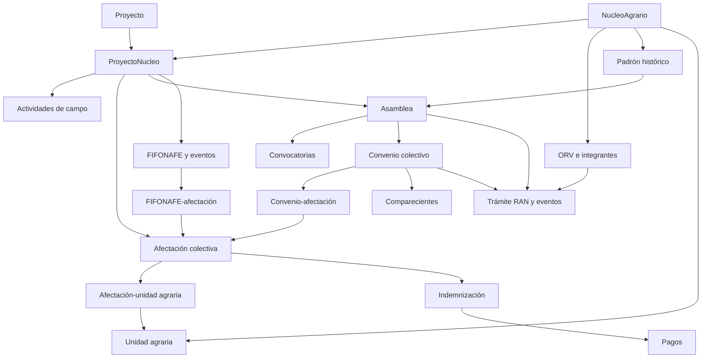

# Informe técnico: derechos colectivos

> **Alcance histórico (aclaración documental, 2026-10-08):** Informe histórico del commit y las bases revisados el 2 de octubre de 2026. La divergencia de linaje descrita abajo pertenece a aquel corte; la cadena canónica actual está estabilizada en 001–028. Esta auditoría documental no revalida el frontend citado en el informe. Véanse [MIGRACIONES.md](MIGRACIONES.md) y [API.md](API.md) para contratos vigentes.

Fecha: 2 de octubre de 2026. Rama: `feature/backend-logica`. Commit revisado: `49f12f747a1eda4fc75930d78e0f23dd00baf422`.

## Resultado de la verificación

La rama implementa la ruta de derechos colectivos mediante entidades compartidas con la ruta individual. No existe una tabla ni un router independiente llamado `derechos_colectivos`: la separación se expresa en `afectacion.tipo_afectacion`, `convenio.ambito`, `tramite_fifonafe.ambito` y `seguimiento_evento.ambito`.

**Base de referencia indicada por el usuario: `software_pa_test`.** En ella se verificaron las tablas colectivas, `vw_convenio_colectivo_destino`, `tramite_fifonafe_interviniente`, `tramite_fifonafe.version_flujo` y `convenio.efecto_monto`. Los checksums registrados de las migraciones `001`–`019` coinciden con los archivos de esta rama.

**Diferencia de historial comprobada:** la base registra `020=derecho_via_proyecto`, `021=importacion_ddv_gpkg`, `022=importacion_nucleos_gpkg` y `023=importacion_parcelas_gpkg`. Esta rama contiene `020_auditoria_heartbeat_sesion.sql`, con otro checksum, y no contiene `021`–`023`. La base incorpora evolución geoespacial adicional; no debe afirmarse equivalencia total de su historial con esta rama. La referencia local `origin/feature/backend-logica` apunta al mismo commit revisado; no se hizo fetch para comprobar cambios remotos posteriores.

La primera inspección se hizo en `db_pruebas_alfredo`, que solo registra `001`–`006`; ese desfase no se atribuye a `software_pa_test`.

El OpenAPI de `http://127.0.0.1:8000/openapi.json` contiene las operaciones públicas de los routers de dominio, reporting y documentos revisados. También coinciden las combinaciones método/ruta con `docs/openapi.json`. Esa coincidencia verifica publicación de contratos, no ejecución exitosa de las operaciones ni igualdad completa de los esquemas.

Alcance: revisión de código, modelos, migraciones, contratos de API, frontend y pruebas existentes; consultas de solo lectura a PostgreSQL. Se consultaron correctamente, con `LIMIT 0`, las vistas `vw_convenio_colectivo_destino`, `vw_fifonafe_cobertura_008`, `vw_fifonafe_indicador_institucional_008` y `vw_reporte_avance_periodo` en `software_pa_test`; esto comprueba disponibilidad/columnas sin evaluar resultados de negocio. No se aplicaron migraciones, no se modificaron registros y no se ejecutó la suite de integración. No se certifica el flujo completo con solicitudes autenticadas ni se audita la calidad de datos históricos.

## 1. Relación funcional



Los documentos, requisitos documentales, eventos de seguimiento y trazabilidad acompañan las entidades del expediente. El diagrama muestra relaciones disponibles; no significa que todos los pasos sean obligatorios en cada alta. En particular, `id_asamblea_autorizacion` del convenio es opcional.

La ruta colectiva admite afectaciones sin parcela. La cadena física canónica es `afectacion → afectacion_unidad_agraria → unidad_agraria`; el destino se obtiene de `unidad_agraria.id_destino_superficie`. El uso común no determina por sí solo el ámbito: tipo de tierra, tipo de gestión, destino y titularidad son dimensiones separadas. Una unidad puede pertenecer al núcleo y participar en afectaciones de distintos expedientes de proyecto.

## 2. Tablas y campos principales

Todos los modelos ORM se encuentran en `backend/app/models.py`; sus enlaces con línea exacta se incluyen en el inventario inferior. Las tablas principales nacen en `backend/db/migrations/001_baseline_v1.sql` y reciben cambios posteriores.

| Grupo | Tablas | Datos y propósito |
|---|---|---|
| Base territorial | `proyecto`, `nucleo_agrario`, `proyecto_nucleo` | Relación proyecto–núcleo; tipo de tenencia y comunidad indígena en el núcleo; residencia, COP planeados, `afecta_tuc` y motivos/revisión en el expediente. |
| Coordinación | `proyecto_nucleo_responsable`, `proyecto_nucleo_referencia` | Responsables, vigencias y referencias operativas. |
| Representación | `persona`, `orv`, `orv_integrante` | Órgano del núcleo, vigencia, integrantes, órgano/cargo y finalización de participación. |
| Padrón | `padron_historial` | Fecha, número de ejidatarios/comuneros y soporte documental; asociado al núcleo. |
| Trabajo de campo | `actividad_campo` | Sensibilización/caminamiento, contexto, programación, realización y afectación opcional. |
| Afectación | `afectacion` | `tipo_afectacion='colectivo'`, superficies, situación, condición especial, avalúo y tipo de COP operativo. |
| Superficie | `unidad_agraria`, `afectacion_unidad_agraria` | Clasificación de tierra/gestión/destino/titularidad; superficie física por vínculo y referencias de origen. |
| Titularidad de unidades | `unidad_agraria_titular` | Personas y participaciones cuando corresponde; no convierte representantes del núcleo en titulares individuales de toda la superficie colectiva. |
| Asamblea | `asamblea`, `asamblea_convocatoria` | Padrón, tipo, contexto, COP operativo, resultado; convocatorias 1:N con ordinal, fechas y resultado catalogado. |
| Instrumentos | `convenio`, `convenio_afectacion` | Ámbito, tipo, padre, asamblea autorizante, fecha de firma, importes 90/100/BDT y superficie declarada; relación N:M con afectaciones. |
| Comparecencia | `convenio_compareciente` | Persona, calidad, acreditación, nombre en instrumento, firmante, beneficiario y revisión. |
| RAN | `tramite_ran`, `tramite_ran_evento` | Trámite de asamblea, convenio u ORV; programación, expediente, ordinales y actuaciones fechadas. |
| FIFONAFE | `tramite_fifonafe`, `tramite_fifonafe_afectacion`, `tramite_fifonafe_evento`, `tramite_fifonafe_interviniente` | Ámbito/estatus, cobertura N:M, versión de flujo, asamblea de retiro, oficios, ciclos de consulta y personas intervinientes. La última tabla se agrega en `008`. |
| Recursos | `indemnizacion`, `pago` | Resolución y monto indemnizatorio por afectación; pagos efectivos, fecha, monto, tipo y beneficiario opcional. |
| Evidencia | `documento`, `documento_version`, `documento_vinculo`, `requisito_documental`, `expediente_requisito` | Metadatos, archivos versionados, vínculos controlados y estados del cumplimiento documental. |
| Seguimiento | `seguimiento_evento`, `trazabilidad_fuente` | Historial operativo por ámbito/entidad y referencia a la fuente. |
| Soporte | `catalogo_operativo`, `catalogo_operativo_alias`, `usuario_proyecto`, `bitacora` | Catálogos, normalización, acceso por proyecto y auditoría. |

Superficies en los modelos actuales: `Numeric(15,7)`. Importes: `Numeric(18,2)`. Las entidades auditables conservan estado activo, actores y fechas; la baja lógica no debe interpretarse como borrado físico generalizado.

## 3. Reglas implementadas que afectan la ruta colectiva

- El convenio toma automáticamente `ambito` y `id_proyecto_nucleo` de la afectación desde la que se crea (`create_agreement` en `backend/app/services/domain.py`). Se crea también su asociación principal.
- Un convenio puede cubrir varias afectaciones. Los vínculos adicionales deben conservar proyecto–núcleo y ámbito; hay validaciones SQL además de controles del servicio.
- Tipos colectivos actuales: `cop_original`, `modificatorio`, `obras_complementarias`. El tipo legado `superficie_adicional` se normaliza a `modificatorio` en `016`; `ADICIONAL`/`2A_ADICIONAL` permanecen como clasificación operativa de la afectación. El contrato actual de alta no admite `superficie_adicional`. `tipo_instrumento` y modalidad se validan por separado; no todo registro de instrumento equivale a un COP original.
- Una asamblea referenciada solo puede autorizar convenios colectivos del mismo expediente y con contexto compatible. El padre debe pertenecer al mismo expediente/ámbito; se rechazan relaciones circulares. Las reglas de antecedente se amplían en `007`.
- Los comparecientes colectivos no usan `id_parcela_titular`. La migración `007` exige para el firmante representación ORV vigente a la fecha del acto, acreditación externa histórica documentada o una marca explícita de revisión. Marcar revisión permite conservar el caso pendiente; no acredita automáticamente su firma.
- El reporting de firma acreditada incorpora requisito/documento y comparecientes validados: `fecha_firma` por sí sola no prueba el cumplimiento completo (`fn_convenio_firma_acreditada_007`).
- Las convocatorias son registros dependientes de una misma asamblea. No deben contarse como asambleas distintas. Los trámites RAN del acta y del convenio se siguen separadamente, con eventos de ingreso, reingreso e inscripción; una calificación intermedia no sustituye inscripción.
- `afecta_tuc` tiene tres estados (`true`, `false`, `null`); existen campos de motivo y revisión. `null` no equivale a no afectación, y no afectar TUC no implica ausencia de toda actuación colectiva.
- Documentos y trazabilidad se vinculan a objetivos controlados, con comprobación de acceso por proyecto. Los archivos tienen versiones y comprobación SHA-256.
- Lectura: roles `admin`, `operador`, `visualizador`, `geografo`; captura administrativa: `admin`, `operador`; geometrías: `admin`, `geografo`. Además se verifica acceso al proyecto y estado activo. Las reglas precisas por operación están en el router y en `backend/app/services/access.py`.

### FIFONAFE: distinguir legado y flujo v2

La regla de cuatro oficios corresponde al flujo legado (`version_flujo=1`): `oficio_fifonafe_dgaopr`, `oficio_dgaopr_representacion`, `respuesta_representacion_dgaopr`, `respuesta_dgaopr_fifonafe`, con número y fecha.

La migración `008_fifonafe_evolucion_forward_only.sql` introduce flujo v2 (por defecto para nuevas altas), eventos, evidencias, intervinientes y ciclos. La conclusión administrativa exige solicitud, resolución autorizada, entrega, comprobación y consulta favorable acreditada o dispensa. Existe una ruta judicial excepcional acreditada por requerimiento y cumplimiento. La cancelación también requiere actuación fechada con soporte.

Por tanto, **cuatro oficios no bastan para declarar completo un trámite v2**. La entrega en FIFONAFE tampoco genera automáticamente un registro `pago`; son hechos distintos.

## 4. Reportes y vistas

| Vista/modelo | Función |
|---|---|
| `vw_proyecto_nucleo_resumen`, `vw_orv_estado` | Resumen del expediente y estado del órgano representativo. |
| `vw_hito_seguimiento`, `vw_reporte_avance_periodo`, `vw_dashboard_kpi` | Hitos realizados/programados e indicadores por período/proyecto. |
| `vw_reporte_snapshot_actual` | Estado actual; tratamiento de no afectación TUC corregido en `012`. |
| `vw_convenio_valor_declarado`, `vw_convenio_impacto`, `vw_reporte_convenio_impacto_periodo`, `vw_convenio_cobertura_impacto` | Separan valores del instrumento de impactos y pendientes de cobertura (`007`). |
| `vw_convenio_colectivo_destino` | Desglose de convenios colectivos por destino físico (`014`, actualizado en `015`). |
| `vw_fifonafe_cobertura_008`, `vw_fifonafe_indicador_institucional_008` | Cobertura/evidencia e indicador institucional propio de FIFONAFE v2. |

En el reporte por destino, `superficie_ha` proviene del vínculo afectación–unidad. `superficie_declarada_ha` y `monto_declarado` pertenecen al convenio y se repiten en cada destino: **no se deben sumar entre filas del mismo convenio**. Contar convenios o asambleas requiere deduplicar sus identificadores. Sin unidades, el destino y la superficie física son `null`; con unidad sin destino, puede conservarse superficie física con destino `null`.

Endpoint principal: `GET /api/reportes/convenios/colectivos-destino`. Filtros: `id_proyecto`, `id_entidad`, `id_proyecto_nucleo`, `id_convenio`, `id_asamblea`, `tipo_convenio`, `tipo_cop_operativo`, `destino_superficie`, `anio`, `mes`, `trimestre`. Hay un alias `/api/reportes/convenios/destinos` oculto en OpenAPI.

Ejemplos de consulta, con una sesión autorizada:

```text
GET /api/proyecto-nucleo/123/afectaciones?tipo=colectivo
GET /api/reportes/avance-periodo?id_proyecto=10&ambito=colectivo&anio=2026
GET /api/reportes/resumen-actual?id_proyecto=10&ambito=colectivo
GET /api/reportes/convenios/colectivos-destino?id_proyecto=10&destino_superficie=tuc
```

Los identificadores son ilustrativos. La lista de afectaciones del expediente puede incluir ambos ámbitos; no se presume un filtro `ambito` donde el contrato no lo declara.

## 5. Migraciones relevantes

| Archivo en `backend/db/migrations/` | Aportación |
|---|---|
| `001_baseline_v1.sql` | Esquema base, relaciones, catálogos, constraints, triggers y vistas iniciales. |
| `002_cierre_fuentes_excel.sql` | Cierre documental/operativo y reglas colectivas de fuentes Excel. |
| `003_reporting_fuentes_excel.sql`, `005_reporting_cierre_excel.sql`, `006_ajustes_reporting_post_auditoria.sql` | Evolución de indicadores y reportes. |
| `004_seguimiento_funcional_excel.sql` | Eventos e historial funcional. |
| `007_convenios_impactos_precision.sql` | Precisión, impacto frente a valor declarado, antecedentes, comparecencia colectiva y firma acreditada. |
| `008_fifonafe_evolucion_forward_only.sql` | Flujo v2, evidencia, intervinientes y reportes propios. |
| `009_bitacora_append_only.sql`, `011_auditoria_actor_update.sql` | Refuerzo de auditoría. |
| `012_correccion_snapshot_tuc_triestado.sql` | Corrección del estado actual de TUC. |
| `013_pagos_en_reporting.sql` | Inclusión de pagos en reportes. |
| `014_convenios_colectivos_por_destino.sql` | Vista específica por destino físico. |
| `015_exclusion_proyectos_inactivos.sql` | Exclusión de proyectos inactivos en las vistas afectadas, incluido reporte por destino. |
| `016_normalizacion_convenio_superficie_adicional.sql`, `017_normalizar_contexto_asamblea_adicional.sql` | Normalización del tipo adicional y contexto de asamblea. |
| `018_orv_persona_ciclo_vida.sql` | Ciclo de vida de personas y participaciones ORV. |
| `019_catalogo_nucleos_ran.sql` | Catálogo territorial de núcleos RAN. |

`010` y `020` tratan credenciales/sesiones y auditoría de autenticación; son soporte transversal, no nuevas entidades colectivas.

## 6. Ubicación del código y documentación

| Ruta | Qué revisar allí |
|---|---|
| `backend/app/main.py` | Registro de routers con prefijo `/api`, CSRF, errores y health. |
| `backend/app/models.py` | Tablas, relaciones ORM y modelos de vistas. |
| `backend/app/schemas.py` | Payloads Create/Update/Response y validaciones de contrato. |
| `backend/app/routers/domain.py` | Endpoints administrativos de la ruta colectiva. |
| `backend/app/services/domain.py` | Altas, relaciones, actualización y ciclo ORV/persona. |
| `backend/app/services/access.py` | Autorización mediante relaciones canónicas por proyecto. |
| `backend/app/services/common.py` | Helpers, persistencia, catálogos y contexto de auditoría. |
| `backend/app/routers/reporting.py` | Reportes, filtros, exportación CSV y mapa. |
| `backend/app/routers/documents.py`, `backend/app/services/documents.py` | Documentos, archivos/versiones, vínculos y trazabilidad. |
| `backend/app/auth.py` | Autenticación y comprobación de roles. |
| `frontend/src/pages/ProjectNucleus.jsx` | Pantalla del expediente: actividades, representación, padrón, asambleas, afectaciones y FIFONAFE. |
| `frontend/src/pages/AffectationDetail.jsx` | Convenios de la afectación, RAN, indemnización y pagos. |
| `frontend/src/components/DocumentsPanel.jsx` | Evidencia documental desde las pantallas. |
| `frontend/src/pages/Dashboard.jsx` | Indicadores y visualización general. |
| `docs/API.md`, `docs/openapi.json` | Descripción y contrato estático de API. |
| `docs/DICCIONARIO_DATOS.md` | Diccionario de tablas/campos. |
| `docs/MODELO_FUNCIONAL.md`, `docs/ARQUITECTURA.md` | Ruta funcional y arquitectura. |
| `docs/FUENTES_Y_COBERTURA_EXCEL.md` | Correspondencia con seguimiento colectivo Excel. |
| `docs/MIGRACIONES.md` | Operación e historial de migraciones. |

## 7. Pruebas existentes y límites

| Prueba en `backend/tests/` | Cobertura identificada en el código |
|---|---|
| `test_target_domain.py` | Entidades y relaciones fundamentales, ámbitos y convenios. |
| `test_agricultural_units_039.py`, `test_affectation_units_039.py` | Unidades agrarias y vínculos con afectaciones. |
| `test_convenios_colectivos_destino.py` | Casos A–J: TUC, múltiples destinos, consolidación, ausencia de unidades/destino, asambleas, multiplicación N:M, baja lógica y aislamiento. |
| `test_cierre_007_convenios_api.py`, `test_cierre_007_convenios_patch.py` | Evolución de convenios y modificaciones por API. |
| `test_cierre_008_fifonafe_api.py`, `test_cierre_008_fifonafe_pre_migracion.py`, `test_fifonafe_intervinientes.py` | FIFONAFE v2, compatibilidad y personas intervinientes. |
| `test_cierre_006_ran_ciclos.py`, `test_ran_programacion.py` | Ciclos y programación de trámites RAN. |
| `test_seguimiento_funcional_004.py` | Eventos colectivos, restricciones y estado de seguimiento. |
| `test_snapshot_tuc_triestado.py` | TUC true/false/null y pendientes. |
| `test_reporting_cierre_005.py`, `test_reporting_post_auditoria_006.py`, `test_pago_reporting.py` | Indicadores, separación de ámbitos y pagos. |
| `test_orv_persona_ciclo_vida.py`, `test_schema_018_orv_persona_ciclo_vida.py` | Vigencias y ciclo ORV/persona. |
| `test_documents_dashboard.py`, `test_document_targets_039.py` | Documentos, objetivos y dashboard. |

También hay regresiones SQL en `backend/db/tests/`, incluidas `007_convenios_impactos_regression.sql` y `006_ajustes_reporting_post_auditoria_contract.sql`. La presencia de pruebas no equivale a resultado aprobado en esta revisión.

`backend/tests/conftest.py` requiere expresamente `APP_ENV=test`, `DB_NAME=software_pa_test` y `TEST_ALLOW_DATABASE=software_pa_test`; varias fixtures también necesitan credenciales de prueba. La base de referencia es `software_pa_test`. Esta revisión conserva alcance de solo lectura: no se ejecutaron las fixtures ni pruebas que escriben datos. Los requisitos del fixture deben cumplirse antes de ejecutar una validación funcional.

## 8. Hallazgos y trabajo pendiente para certificar operación

1. **Ruta colectiva presente en la base de referencia; historial posterior diferente.** `software_pa_test` tiene los objetos revisados y coincide por checksum hasta `019`. Su `020` corresponde a derecho de vía, mientras esta rama usa ese número para heartbeat de auditoría; además tiene `021`–`023`. Antes de ejecutar el migrador de esta rama sobre esa base, debe conciliarse el historial. No se aplicaron cambios de esquema.
2. **FIFONAFE v2 no está reflejado completamente en la pantalla inspeccionada.** `ProjectNucleus.jsx` sigue mostrando el formulario de cuatro oficios y el contador `Oficios: …/4`. El backend ofrece eventos, intervinientes, ciclos y requisitos integrales v2. No se identificó en esa pantalla una captura equivalente de todo el flujo v2; no puede considerarse suficiente para completarlo.
3. **Documentación funcional del legado.** `docs/MODELO_FUNCIONAL.md`, sección 9.2, describe la culminación por cuatro oficios. Debe leerse junto a `008`, que distingue versiones y exige evidencia integral para v2; no aplicar esa regla antigua a toda nueva alta.
4. **API publicada frente a operación efectiva.** Las rutas públicas contrastadas aparecen en OpenAPI, pero faltan pruebas autenticadas contra la base de referencia. No se atribuye un código HTTP concreto a operaciones que no se invocaron.
5. **Agregación del desglose colectivo.** Los consumidores deben deduplicar montos/superficies declaradas por convenio y asambleas por identificador. Una suma directa de todas las filas por destino puede duplicar importes.

Para cerrar la validación funcional faltaría conciliar el historial desde `020`, ejecutar la suite pertinente en `software_pa_test` y probar un expediente colectivo completo: unidad/afectación → asamblea/convocatorias → convenio/comparecencia/evidencia → RAN → FIFONAFE v2 → indemnización/pagos → reportes.

## 9. Inventario de modelos con rutas exactas

| Tabla/vista | Modelo | Archivo |
|---|---|---|
| `entidad_federativa` | `EntidadFederativa` | [models.py:54](/home/alfredo/proyectos/Software-PA/backend/app/models.py:54) |
| `municipio` | `Municipio` | [models.py:65](/home/alfredo/proyectos/Software-PA/backend/app/models.py:65) |
| `catalogo_operativo` | `CatalogoOperativo` | [models.py:78](/home/alfredo/proyectos/Software-PA/backend/app/models.py:78) |
| `catalogo_operativo_alias` | `CatalogoOperativoAlias` | [models.py:96](/home/alfredo/proyectos/Software-PA/backend/app/models.py:96) |
| `proyecto` | `Proyecto` | [models.py:200](/home/alfredo/proyectos/Software-PA/backend/app/models.py:200) |
| `nucleo_agrario` | `NucleoAgrario` | [models.py:217](/home/alfredo/proyectos/Software-PA/backend/app/models.py:217) |
| `proyecto_nucleo` | `ProyectoNucleo` | [models.py:247](/home/alfredo/proyectos/Software-PA/backend/app/models.py:247) |
| `proyecto_nucleo_responsable` | `ProyectoNucleoResponsable` | [models.py:298](/home/alfredo/proyectos/Software-PA/backend/app/models.py:298) |
| `proyecto_nucleo_referencia` | `ProyectoNucleoReferencia` | [models.py:315](/home/alfredo/proyectos/Software-PA/backend/app/models.py:315) |
| `persona` | `Persona` | [models.py:329](/home/alfredo/proyectos/Software-PA/backend/app/models.py:329) |
| `orv` | `Orv` | [models.py:353](/home/alfredo/proyectos/Software-PA/backend/app/models.py:353) |
| `orv_integrante` | `OrvIntegrante` | [models.py:382](/home/alfredo/proyectos/Software-PA/backend/app/models.py:382) |
| `padron_historial` | `PadronHistorial` | [models.py:410](/home/alfredo/proyectos/Software-PA/backend/app/models.py:410) |
| `actividad_campo` | `ActividadCampo` | [models.py:463](/home/alfredo/proyectos/Software-PA/backend/app/models.py:463) |
| `afectacion` | `Afectacion` | [models.py:484](/home/alfredo/proyectos/Software-PA/backend/app/models.py:484) |
| `unidad_agraria` | `UnidadAgraria` | [models.py:519](/home/alfredo/proyectos/Software-PA/backend/app/models.py:519) |
| `unidad_agraria_titular` | `UnidadAgrariaTitular` | [models.py:546](/home/alfredo/proyectos/Software-PA/backend/app/models.py:546) |
| `afectacion_unidad_agraria` | `AfectacionUnidadAgraria` | [models.py:561](/home/alfredo/proyectos/Software-PA/backend/app/models.py:561) |
| `asamblea` | `Asamblea` | [models.py:577](/home/alfredo/proyectos/Software-PA/backend/app/models.py:577) |
| `asamblea_convocatoria` | `AsambleaConvocatoria` | [models.py:615](/home/alfredo/proyectos/Software-PA/backend/app/models.py:615) |
| `convenio` | `Convenio` | [models.py:634](/home/alfredo/proyectos/Software-PA/backend/app/models.py:634) |
| `convenio_afectacion` | `ConvenioAfectacion` | [models.py:681](/home/alfredo/proyectos/Software-PA/backend/app/models.py:681) |
| `convenio_compareciente` | `ConvenioCompareciente` | [models.py:697](/home/alfredo/proyectos/Software-PA/backend/app/models.py:697) |
| `tramite_ran` | `TramiteRan` | [models.py:719](/home/alfredo/proyectos/Software-PA/backend/app/models.py:719) |
| `tramite_ran_evento` | `TramiteRanEvento` | [models.py:743](/home/alfredo/proyectos/Software-PA/backend/app/models.py:743) |
| `tramite_fifonafe` | `TramiteFifonafe` | [models.py:765](/home/alfredo/proyectos/Software-PA/backend/app/models.py:765) |
| `tramite_fifonafe_evento` | `TramiteFifonafeEvento` | [models.py:796](/home/alfredo/proyectos/Software-PA/backend/app/models.py:796) |
| `tramite_fifonafe_interviniente` | `TramiteFifonafeInterviniente` | [models.py:823](/home/alfredo/proyectos/Software-PA/backend/app/models.py:823) |
| `tramite_fifonafe_afectacion` | `TramiteFifonafeAfectacion` | [models.py:845](/home/alfredo/proyectos/Software-PA/backend/app/models.py:845) |
| `indemnizacion` | `Indemnizacion` | [models.py:862](/home/alfredo/proyectos/Software-PA/backend/app/models.py:862) |
| `pago` | `Pago` | [models.py:879](/home/alfredo/proyectos/Software-PA/backend/app/models.py:879) |
| `documento` | `Documento` | [models.py:897](/home/alfredo/proyectos/Software-PA/backend/app/models.py:897) |
| `documento_version` | `DocumentoVersion` | [models.py:916](/home/alfredo/proyectos/Software-PA/backend/app/models.py:916) |
| `documento_vinculo` | `DocumentoVinculo` | [models.py:946](/home/alfredo/proyectos/Software-PA/backend/app/models.py:946) |
| `seguimiento_evento` | `SeguimientoEvento` | [models.py:959](/home/alfredo/proyectos/Software-PA/backend/app/models.py:959) |
| `trazabilidad_fuente` | `TrazabilidadFuente` | [models.py:986](/home/alfredo/proyectos/Software-PA/backend/app/models.py:986) |
| `requisito_documental` | `RequisitoDocumental` | [models.py:1009](/home/alfredo/proyectos/Software-PA/backend/app/models.py:1009) |
| `expediente_requisito` | `ExpedienteRequisito` | [models.py:1028](/home/alfredo/proyectos/Software-PA/backend/app/models.py:1028) |
| `usuario_proyecto` | `UsuarioProyecto` | [models.py:1091](/home/alfredo/proyectos/Software-PA/backend/app/models.py:1091) |
| `bitacora` | `Bitacora` | [models.py:1109](/home/alfredo/proyectos/Software-PA/backend/app/models.py:1109) |
| `vw_orv_estado` | `OrvEstado` | [models.py:1281](/home/alfredo/proyectos/Software-PA/backend/app/models.py:1281) |
| `vw_proyecto_nucleo_resumen` | `ProyectoNucleoResumen` | [models.py:1297](/home/alfredo/proyectos/Software-PA/backend/app/models.py:1297) |
| `vw_dashboard_kpi` | `DashboardKpi` | [models.py:1346](/home/alfredo/proyectos/Software-PA/backend/app/models.py:1346) |
| `vw_reporte_avance_periodo` | `ReporteAvancePeriodo` | [models.py:1359](/home/alfredo/proyectos/Software-PA/backend/app/models.py:1359) |
| `vw_reporte_snapshot_actual` | `ReporteSnapshotActual` | [models.py:1378](/home/alfredo/proyectos/Software-PA/backend/app/models.py:1378) |
| `vw_fifonafe_cobertura_008` | `FifonafeCobertura` | [models.py:1392](/home/alfredo/proyectos/Software-PA/backend/app/models.py:1392) |
| `vw_fifonafe_indicador_institucional_008` | `FifonafeIndicadorInstitucional` | [models.py:1406](/home/alfredo/proyectos/Software-PA/backend/app/models.py:1406) |
| `vw_convenio_valor_declarado` | `ConvenioValorDeclarado` | [models.py:1416](/home/alfredo/proyectos/Software-PA/backend/app/models.py:1416) |
| `vw_convenio_impacto` | `ConvenioImpacto` | [models.py:1433](/home/alfredo/proyectos/Software-PA/backend/app/models.py:1433) |
| `vw_reporte_convenio_impacto_periodo` | `ReporteConvenioImpactoPeriodo` | [models.py:1455](/home/alfredo/proyectos/Software-PA/backend/app/models.py:1455) |
| `vw_convenio_cobertura_impacto` | `ConvenioCoberturaImpacto` | [models.py:1473](/home/alfredo/proyectos/Software-PA/backend/app/models.py:1473) |
| `vw_convenio_colectivo_destino` | `ConvenioColectivoDestino` | [models.py:1487](/home/alfredo/proyectos/Software-PA/backend/app/models.py:1487) |

## 10. Inventario de endpoints con métodos y archivos

Todas las rutas incluyen el prefijo real `/api`. `{…}` es un parámetro de ruta. Se incluyen operaciones colectivas y compartidas que permiten construir su expediente; se omiten administración general de usuarios, parcelas/titulares individuales y asignaciones de proyecto. La ausencia de un GET o DELETE particular en el inventario no se sustituye por un CRUD supuesto.

### domain

| Método | Endpoint | Implementación |
|---|---|---|
| GET | `/api/catalogos/entidades` | [domain.py:41](/home/alfredo/proyectos/Software-PA/backend/app/routers/domain.py:41) |
| GET | `/api/catalogos/municipios` | [domain.py:51](/home/alfredo/proyectos/Software-PA/backend/app/routers/domain.py:51) |
| GET | `/api/catalogos/nucleos` | [domain.py:66](/home/alfredo/proyectos/Software-PA/backend/app/routers/domain.py:66) |
| GET | `/api/catalogos/operativos/{tipo_catalogo}` | [domain.py:87](/home/alfredo/proyectos/Software-PA/backend/app/routers/domain.py:87) |
| POST | `/api/catalogos/operativos` | [domain.py:110](/home/alfredo/proyectos/Software-PA/backend/app/routers/domain.py:110) |
| PATCH | `/api/catalogos/operativos/opciones/{id_catalogo_opcion}` | [domain.py:122](/home/alfredo/proyectos/Software-PA/backend/app/routers/domain.py:122) |
| GET | `/api/proyectos` | [domain.py:137](/home/alfredo/proyectos/Software-PA/backend/app/routers/domain.py:137) |
| POST | `/api/proyectos` | [domain.py:149](/home/alfredo/proyectos/Software-PA/backend/app/routers/domain.py:149) |
| GET | `/api/proyectos/{id_proyecto}` | [domain.py:158](/home/alfredo/proyectos/Software-PA/backend/app/routers/domain.py:158) |
| PATCH | `/api/proyectos/{id_proyecto}` | [domain.py:167](/home/alfredo/proyectos/Software-PA/backend/app/routers/domain.py:167) |
| DELETE | `/api/proyectos/{id_proyecto}` | [domain.py:178](/home/alfredo/proyectos/Software-PA/backend/app/routers/domain.py:178) |
| GET | `/api/nucleos` | [domain.py:190](/home/alfredo/proyectos/Software-PA/backend/app/routers/domain.py:190) |
| POST | `/api/nucleos` | [domain.py:214](/home/alfredo/proyectos/Software-PA/backend/app/routers/domain.py:214) |
| GET | `/api/nucleos/{id_nucleo}` | [domain.py:223](/home/alfredo/proyectos/Software-PA/backend/app/routers/domain.py:223) |
| PATCH | `/api/nucleos/{id_nucleo}` | [domain.py:238](/home/alfredo/proyectos/Software-PA/backend/app/routers/domain.py:238) |
| PATCH | `/api/nucleos/{id_nucleo}/geometria` | [domain.py:252](/home/alfredo/proyectos/Software-PA/backend/app/routers/domain.py:252) |
| GET | `/api/proyectos/{id_proyecto}/nucleos` | [domain.py:266](/home/alfredo/proyectos/Software-PA/backend/app/routers/domain.py:266) |
| POST | `/api/proyectos/{id_proyecto}/nucleos` | [domain.py:298](/home/alfredo/proyectos/Software-PA/backend/app/routers/domain.py:298) |
| GET | `/api/proyecto-nucleo/{id_proyecto_nucleo}` | [domain.py:312](/home/alfredo/proyectos/Software-PA/backend/app/routers/domain.py:312) |
| PATCH | `/api/proyecto-nucleo/{id_proyecto_nucleo}` | [domain.py:328](/home/alfredo/proyectos/Software-PA/backend/app/routers/domain.py:328) |
| DELETE | `/api/proyecto-nucleo/{id_proyecto_nucleo}` | [domain.py:345](/home/alfredo/proyectos/Software-PA/backend/app/routers/domain.py:345) |
| GET | `/api/proyecto-nucleo/{id_proyecto_nucleo}/referencias` | [domain.py:362](/home/alfredo/proyectos/Software-PA/backend/app/routers/domain.py:362) |
| POST | `/api/proyecto-nucleo/{id_proyecto_nucleo}/referencias` | [domain.py:383](/home/alfredo/proyectos/Software-PA/backend/app/routers/domain.py:383) |
| PATCH | `/api/referencias/{id_referencia}` | [domain.py:396](/home/alfredo/proyectos/Software-PA/backend/app/routers/domain.py:396) |
| GET | `/api/proyecto-nucleo/{id_proyecto_nucleo}/responsables` | [domain.py:417](/home/alfredo/proyectos/Software-PA/backend/app/routers/domain.py:417) |
| POST | `/api/proyecto-nucleo/{id_proyecto_nucleo}/responsables` | [domain.py:437](/home/alfredo/proyectos/Software-PA/backend/app/routers/domain.py:437) |
| PATCH | `/api/responsables/{id_responsable}` | [domain.py:450](/home/alfredo/proyectos/Software-PA/backend/app/routers/domain.py:450) |
| POST | `/api/proyectos/{id_proyecto}/personas` | [domain.py:470](/home/alfredo/proyectos/Software-PA/backend/app/routers/domain.py:470) |
| GET | `/api/personas/{id_persona}` | [domain.py:481](/home/alfredo/proyectos/Software-PA/backend/app/routers/domain.py:481) |
| PATCH | `/api/personas/{id_persona}` | [domain.py:490](/home/alfredo/proyectos/Software-PA/backend/app/routers/domain.py:490) |
| DELETE | `/api/personas/{id_persona}` | [domain.py:503](/home/alfredo/proyectos/Software-PA/backend/app/routers/domain.py:503) |
| POST | `/api/personas/{id_persona}/reactivar` | [domain.py:517](/home/alfredo/proyectos/Software-PA/backend/app/routers/domain.py:517) |
| GET | `/api/proyecto-nucleo/{id_proyecto_nucleo}/orv` | [domain.py:529](/home/alfredo/proyectos/Software-PA/backend/app/routers/domain.py:529) |
| POST | `/api/proyecto-nucleo/{id_proyecto_nucleo}/orv` | [domain.py:546](/home/alfredo/proyectos/Software-PA/backend/app/routers/domain.py:546) |
| PATCH | `/api/orv/{id_orv}` | [domain.py:556](/home/alfredo/proyectos/Software-PA/backend/app/routers/domain.py:556) |
| POST | `/api/orv/{id_orv}/integrantes` | [domain.py:572](/home/alfredo/proyectos/Software-PA/backend/app/routers/domain.py:572) |
| GET | `/api/orv/{id_orv}/integrantes` | [domain.py:587](/home/alfredo/proyectos/Software-PA/backend/app/routers/domain.py:587) |
| PATCH | `/api/orv-integrantes/{id_orv_integrante}` | [domain.py:604](/home/alfredo/proyectos/Software-PA/backend/app/routers/domain.py:604) |
| POST | `/api/orv-integrantes/{id_orv_integrante}/finalizar` | [domain.py:623](/home/alfredo/proyectos/Software-PA/backend/app/routers/domain.py:623) |
| DELETE | `/api/orv-integrantes/{id_orv_integrante}` | [domain.py:636](/home/alfredo/proyectos/Software-PA/backend/app/routers/domain.py:636) |
| POST | `/api/orv-integrantes/{id_orv_integrante}/reactivar` | [domain.py:650](/home/alfredo/proyectos/Software-PA/backend/app/routers/domain.py:650) |
| GET | `/api/proyecto-nucleo/{id_proyecto_nucleo}/padrones` | [domain.py:662](/home/alfredo/proyectos/Software-PA/backend/app/routers/domain.py:662) |
| POST | `/api/proyecto-nucleo/{id_proyecto_nucleo}/padrones` | [domain.py:679](/home/alfredo/proyectos/Software-PA/backend/app/routers/domain.py:679) |
| PATCH | `/api/padrones/{id_padron}` | [domain.py:689](/home/alfredo/proyectos/Software-PA/backend/app/routers/domain.py:689) |
| GET | `/api/proyecto-nucleo/{id_proyecto_nucleo}/actividades` | [domain.py:707](/home/alfredo/proyectos/Software-PA/backend/app/routers/domain.py:707) |
| POST | `/api/proyecto-nucleo/{id_proyecto_nucleo}/actividades` | [domain.py:731](/home/alfredo/proyectos/Software-PA/backend/app/routers/domain.py:731) |
| PATCH | `/api/actividades/{id_actividad}` | [domain.py:741](/home/alfredo/proyectos/Software-PA/backend/app/routers/domain.py:741) |
| GET | `/api/proyecto-nucleo/{id_proyecto_nucleo}/afectaciones` | [domain.py:892](/home/alfredo/proyectos/Software-PA/backend/app/routers/domain.py:892) |
| POST | `/api/proyecto-nucleo/{id_proyecto_nucleo}/afectaciones` | [domain.py:913](/home/alfredo/proyectos/Software-PA/backend/app/routers/domain.py:913) |
| GET | `/api/afectaciones/{id_afectacion}` | [domain.py:923](/home/alfredo/proyectos/Software-PA/backend/app/routers/domain.py:923) |
| PATCH | `/api/afectaciones/{id_afectacion}` | [domain.py:932](/home/alfredo/proyectos/Software-PA/backend/app/routers/domain.py:932) |
| DELETE | `/api/afectaciones/{id_afectacion}` | [domain.py:943](/home/alfredo/proyectos/Software-PA/backend/app/routers/domain.py:943) |
| GET | `/api/proyecto-nucleo/{id_proyecto_nucleo}/seguimiento` | [domain.py:958](/home/alfredo/proyectos/Software-PA/backend/app/routers/domain.py:958) |
| POST | `/api/proyecto-nucleo/{id_proyecto_nucleo}/seguimiento` | [domain.py:978](/home/alfredo/proyectos/Software-PA/backend/app/routers/domain.py:978) |
| GET | `/api/seguimiento/{id_seguimiento_evento}` | [domain.py:988](/home/alfredo/proyectos/Software-PA/backend/app/routers/domain.py:988) |
| PATCH | `/api/seguimiento/{id_seguimiento_evento}` | [domain.py:1002](/home/alfredo/proyectos/Software-PA/backend/app/routers/domain.py:1002) |
| DELETE | `/api/seguimiento/{id_seguimiento_evento}` | [domain.py:1017](/home/alfredo/proyectos/Software-PA/backend/app/routers/domain.py:1017) |
| GET | `/api/proyecto-nucleo/{id_proyecto_nucleo}/asambleas` | [domain.py:1036](/home/alfredo/proyectos/Software-PA/backend/app/routers/domain.py:1036) |
| POST | `/api/proyecto-nucleo/{id_proyecto_nucleo}/asambleas` | [domain.py:1053](/home/alfredo/proyectos/Software-PA/backend/app/routers/domain.py:1053) |
| PATCH | `/api/asambleas/{id_asamblea}` | [domain.py:1063](/home/alfredo/proyectos/Software-PA/backend/app/routers/domain.py:1063) |
| GET | `/api/asambleas/{id_asamblea}/convocatorias` | [domain.py:1077](/home/alfredo/proyectos/Software-PA/backend/app/routers/domain.py:1077) |
| POST | `/api/asambleas/{id_asamblea}/convocatorias` | [domain.py:1094](/home/alfredo/proyectos/Software-PA/backend/app/routers/domain.py:1094) |
| PATCH | `/api/convocatorias/{id_convocatoria}` | [domain.py:1107](/home/alfredo/proyectos/Software-PA/backend/app/routers/domain.py:1107) |
| POST | `/api/tramites-ran` | [domain.py:1126](/home/alfredo/proyectos/Software-PA/backend/app/routers/domain.py:1126) |
| GET | `/api/tramites-ran/{id_tramite_ran}` | [domain.py:1138](/home/alfredo/proyectos/Software-PA/backend/app/routers/domain.py:1138) |
| PATCH | `/api/tramites-ran/{id_tramite_ran}` | [domain.py:1155](/home/alfredo/proyectos/Software-PA/backend/app/routers/domain.py:1155) |
| GET | `/api/asambleas/{id_asamblea}/tramites-ran` | [domain.py:1169](/home/alfredo/proyectos/Software-PA/backend/app/routers/domain.py:1169) |
| GET | `/api/convenios/{id_convenio}/tramites-ran` | [domain.py:1185](/home/alfredo/proyectos/Software-PA/backend/app/routers/domain.py:1185) |
| GET | `/api/orv/{id_orv}/tramites-ran` | [domain.py:1201](/home/alfredo/proyectos/Software-PA/backend/app/routers/domain.py:1201) |
| GET | `/api/proyecto-nucleo/{id_proyecto_nucleo}/tramites-ran` | [domain.py:1218](/home/alfredo/proyectos/Software-PA/backend/app/routers/domain.py:1218) |
| POST | `/api/tramites-ran/{id_tramite_ran}/eventos` | [domain.py:1235](/home/alfredo/proyectos/Software-PA/backend/app/routers/domain.py:1235) |
| GET | `/api/tramites-ran/{id_tramite_ran}/eventos` | [domain.py:1249](/home/alfredo/proyectos/Software-PA/backend/app/routers/domain.py:1249) |
| PATCH | `/api/eventos-ran/{id_evento_ran}` | [domain.py:1265](/home/alfredo/proyectos/Software-PA/backend/app/routers/domain.py:1265) |
| GET | `/api/afectaciones/{id_afectacion}/convenios` | [domain.py:1283](/home/alfredo/proyectos/Software-PA/backend/app/routers/domain.py:1283) |
| POST | `/api/afectaciones/{id_afectacion}/convenios` | [domain.py:1301](/home/alfredo/proyectos/Software-PA/backend/app/routers/domain.py:1301) |
| GET | `/api/convenios/{id_convenio}` | [domain.py:1311](/home/alfredo/proyectos/Software-PA/backend/app/routers/domain.py:1311) |
| PATCH | `/api/convenios/{id_convenio}` | [domain.py:1320](/home/alfredo/proyectos/Software-PA/backend/app/routers/domain.py:1320) |
| GET | `/api/convenios/{id_convenio}/comparecientes` | [domain.py:1334](/home/alfredo/proyectos/Software-PA/backend/app/routers/domain.py:1334) |
| POST | `/api/convenios/{id_convenio}/comparecientes` | [domain.py:1351](/home/alfredo/proyectos/Software-PA/backend/app/routers/domain.py:1351) |
| PATCH | `/api/convenio-comparecientes/{id_compareciente}` | [domain.py:1364](/home/alfredo/proyectos/Software-PA/backend/app/routers/domain.py:1364) |
| DELETE | `/api/convenio-comparecientes/{id_compareciente}` | [domain.py:1380](/home/alfredo/proyectos/Software-PA/backend/app/routers/domain.py:1380) |
| GET | `/api/convenios/{id_convenio}/afectaciones` | [domain.py:1400](/home/alfredo/proyectos/Software-PA/backend/app/routers/domain.py:1400) |
| POST | `/api/convenios/{id_convenio}/afectaciones` | [domain.py:1417](/home/alfredo/proyectos/Software-PA/backend/app/routers/domain.py:1417) |
| PATCH | `/api/convenio-afectaciones/{id_convenio_afectacion}` | [domain.py:1432](/home/alfredo/proyectos/Software-PA/backend/app/routers/domain.py:1432) |
| GET | `/api/proyecto-nucleo/{id_proyecto_nucleo}/fifonafe` | [domain.py:1451](/home/alfredo/proyectos/Software-PA/backend/app/routers/domain.py:1451) |
| POST | `/api/proyecto-nucleo/{id_proyecto_nucleo}/fifonafe` | [domain.py:1468](/home/alfredo/proyectos/Software-PA/backend/app/routers/domain.py:1468) |
| PATCH | `/api/fifonafe/{id_tramite_fifonafe}` | [domain.py:1481](/home/alfredo/proyectos/Software-PA/backend/app/routers/domain.py:1481) |
| POST | `/api/fifonafe/{id_tramite_fifonafe}/afectaciones` | [domain.py:1498](/home/alfredo/proyectos/Software-PA/backend/app/routers/domain.py:1498) |
| GET | `/api/fifonafe/{id_tramite_fifonafe}/eventos` | [domain.py:1513](/home/alfredo/proyectos/Software-PA/backend/app/routers/domain.py:1513) |
| POST | `/api/fifonafe/{id_tramite_fifonafe}/eventos` | [domain.py:1530](/home/alfredo/proyectos/Software-PA/backend/app/routers/domain.py:1530) |
| PATCH | `/api/eventos-fifonafe/{id_evento_fifonafe}` | [domain.py:1544](/home/alfredo/proyectos/Software-PA/backend/app/routers/domain.py:1544) |
| DELETE | `/api/eventos-fifonafe/{id_evento_fifonafe}` | [domain.py:1562](/home/alfredo/proyectos/Software-PA/backend/app/routers/domain.py:1562) |
| GET | `/api/fifonafe/{id_tramite_fifonafe}/intervinientes` | [domain.py:1584](/home/alfredo/proyectos/Software-PA/backend/app/routers/domain.py:1584) |
| POST | `/api/fifonafe/{id_tramite_fifonafe}/intervinientes` | [domain.py:1607](/home/alfredo/proyectos/Software-PA/backend/app/routers/domain.py:1607) |
| DELETE | `/api/intervinientes-fifonafe/{id_interviniente_fifonafe}` | [domain.py:1621](/home/alfredo/proyectos/Software-PA/backend/app/routers/domain.py:1621) |
| GET | `/api/catalogos/requisitos-documentales` | [domain.py:1643](/home/alfredo/proyectos/Software-PA/backend/app/routers/domain.py:1643) |
| GET | `/api/proyecto-nucleo/{id_proyecto_nucleo}/requisitos-documentales` | [domain.py:1658](/home/alfredo/proyectos/Software-PA/backend/app/routers/domain.py:1658) |
| POST | `/api/proyecto-nucleo/{id_proyecto_nucleo}/requisitos-documentales` | [domain.py:1675](/home/alfredo/proyectos/Software-PA/backend/app/routers/domain.py:1675) |
| PATCH | `/api/requisitos-documentales/{id_expediente_requisito}` | [domain.py:1688](/home/alfredo/proyectos/Software-PA/backend/app/routers/domain.py:1688) |
| GET | `/api/afectaciones/{id_afectacion}/indemnizacion` | [domain.py:1707](/home/alfredo/proyectos/Software-PA/backend/app/routers/domain.py:1707) |
| POST | `/api/afectaciones/{id_afectacion}/indemnizacion` | [domain.py:1724](/home/alfredo/proyectos/Software-PA/backend/app/routers/domain.py:1724) |
| PATCH | `/api/indemnizaciones/{id_indemnizacion}` | [domain.py:1737](/home/alfredo/proyectos/Software-PA/backend/app/routers/domain.py:1737) |
| GET | `/api/indemnizaciones/{id_indemnizacion}/pagos` | [domain.py:1753](/home/alfredo/proyectos/Software-PA/backend/app/routers/domain.py:1753) |
| POST | `/api/indemnizaciones/{id_indemnizacion}/pagos` | [domain.py:1770](/home/alfredo/proyectos/Software-PA/backend/app/routers/domain.py:1770) |
| PATCH | `/api/pagos/{id_pago}` | [domain.py:1780](/home/alfredo/proyectos/Software-PA/backend/app/routers/domain.py:1780) |
| GET | `/api/proyectos/{id_proyecto}/trazos` | [domain.py:1794](/home/alfredo/proyectos/Software-PA/backend/app/routers/domain.py:1794) |
| POST | `/api/proyectos/{id_proyecto}/trazos` | [domain.py:1820](/home/alfredo/proyectos/Software-PA/backend/app/routers/domain.py:1820) |
| POST | `/api/nucleos/{nucleo_id}/unidades-agrarias` | [domain.py:1882](/home/alfredo/proyectos/Software-PA/backend/app/routers/domain.py:1882) |
| GET | `/api/proyecto-nucleo/{id_proyecto_nucleo}/unidades-agrarias` | [domain.py:1892](/home/alfredo/proyectos/Software-PA/backend/app/routers/domain.py:1892) |
| POST | `/api/proyecto-nucleo/{id_proyecto_nucleo}/unidades-agrarias` | [domain.py:1898](/home/alfredo/proyectos/Software-PA/backend/app/routers/domain.py:1898) |
| GET | `/api/nucleos/{nucleo_id}/unidades-agrarias` | [domain.py:1906](/home/alfredo/proyectos/Software-PA/backend/app/routers/domain.py:1906) |
| PATCH | `/api/unidades-agrarias/{unidad_id}` | [domain.py:1918](/home/alfredo/proyectos/Software-PA/backend/app/routers/domain.py:1918) |
| GET | `/api/unidades-agrarias/{unidad_id}` | [domain.py:1928](/home/alfredo/proyectos/Software-PA/backend/app/routers/domain.py:1928) |
| DELETE | `/api/unidades-agrarias/{unidad_id}` | [domain.py:1934](/home/alfredo/proyectos/Software-PA/backend/app/routers/domain.py:1934) |
| GET | `/api/unidades-agrarias/{unidad_id}/titulares` | [domain.py:1945](/home/alfredo/proyectos/Software-PA/backend/app/routers/domain.py:1945) |
| POST | `/api/unidades-agrarias/{unidad_id}/titulares` | [domain.py:1952](/home/alfredo/proyectos/Software-PA/backend/app/routers/domain.py:1952) |
| PATCH | `/api/unidad-agraria-titulares/{id_unidad_titular}` | [domain.py:1957](/home/alfredo/proyectos/Software-PA/backend/app/routers/domain.py:1957) |
| DELETE | `/api/unidad-agraria-titulares/{id_unidad_titular}` | [domain.py:1965](/home/alfredo/proyectos/Software-PA/backend/app/routers/domain.py:1965) |
| POST | `/api/afectaciones/{afectacion_id}/unidades-agrarias` | [domain.py:1978](/home/alfredo/proyectos/Software-PA/backend/app/routers/domain.py:1978) |
| GET | `/api/afectaciones/{afectacion_id}/unidades-agrarias` | [domain.py:1991](/home/alfredo/proyectos/Software-PA/backend/app/routers/domain.py:1991) |
| PATCH | `/api/afectacion-unidades-agrarias/{id_afectacion_unidad}` | [domain.py:2003](/home/alfredo/proyectos/Software-PA/backend/app/routers/domain.py:2003) |
| DELETE | `/api/afectacion-unidades-agrarias/{id_afectacion_unidad}` | [domain.py:2024](/home/alfredo/proyectos/Software-PA/backend/app/routers/domain.py:2024) |

### reporting

| Método | Endpoint | Implementación |
|---|---|---|
| GET | `/api/dashboard/kpi` | [reporting.py:41](/home/alfredo/proyectos/Software-PA/backend/app/routers/reporting.py:41) |
| GET | `/api/reportes/avance-periodo` | [reporting.py:57](/home/alfredo/proyectos/Software-PA/backend/app/routers/reporting.py:57) |
| GET | `/api/reportes/resumen-actual` | [reporting.py:104](/home/alfredo/proyectos/Software-PA/backend/app/routers/reporting.py:104) |
| GET | `/api/reportes/convenios/valores-declarados` | [reporting.py:196](/home/alfredo/proyectos/Software-PA/backend/app/routers/reporting.py:196) |
| GET | `/api/reportes/convenios/impactos` | [reporting.py:236](/home/alfredo/proyectos/Software-PA/backend/app/routers/reporting.py:236) |
| GET | `/api/reportes/convenios/impactos-periodo` | [reporting.py:282](/home/alfredo/proyectos/Software-PA/backend/app/routers/reporting.py:282) |
| GET | `/api/reportes/convenios/cobertura-impactos` | [reporting.py:333](/home/alfredo/proyectos/Software-PA/backend/app/routers/reporting.py:333) |
| GET | `/api/reportes/convenios/colectivos-destino` | [reporting.py:376](/home/alfredo/proyectos/Software-PA/backend/app/routers/reporting.py:376) |
| GET | `/api/reportes/convenios/destinos` (alias oculto) | [reporting.py:376](/home/alfredo/proyectos/Software-PA/backend/app/routers/reporting.py:376) |
| GET | `/api/reportes/fifonafe/cobertura` | [reporting.py:424](/home/alfredo/proyectos/Software-PA/backend/app/routers/reporting.py:424) |
| GET | `/api/reportes/fifonafe/indicador-institucional` | [reporting.py:449](/home/alfredo/proyectos/Software-PA/backend/app/routers/reporting.py:449) |
| GET | `/api/exportaciones/dashboard.csv` | [reporting.py:476](/home/alfredo/proyectos/Software-PA/backend/app/routers/reporting.py:476) |
| GET | `/api/proyectos/{id_proyecto}/mapa` | [reporting.py:523](/home/alfredo/proyectos/Software-PA/backend/app/routers/reporting.py:523) |

### documents

| Método | Endpoint | Implementación |
|---|---|---|
| GET | `/api/documentos/objetivos/{entidad_tipo}/{entidad_id}` | [documents.py:26](/home/alfredo/proyectos/Software-PA/backend/app/routers/documents.py:26) |
| POST | `/api/documentos/objetivos/{entidad_tipo}/{entidad_id}` | [documents.py:46](/home/alfredo/proyectos/Software-PA/backend/app/routers/documents.py:46) |
| PATCH | `/api/documentos/{id_documento}` | [documents.py:57](/home/alfredo/proyectos/Software-PA/backend/app/routers/documents.py:57) |
| GET | `/api/trazabilidad/objetivos/{entidad_tipo}/{entidad_id}` | [documents.py:71](/home/alfredo/proyectos/Software-PA/backend/app/routers/documents.py:71) |
| POST | `/api/trazabilidad/objetivos/{entidad_tipo}/{entidad_id}` | [documents.py:89](/home/alfredo/proyectos/Software-PA/backend/app/routers/documents.py:89) |
| POST | `/api/documentos/{id_documento}/vinculos/{entidad_tipo}/{entidad_id}` | [documents.py:114](/home/alfredo/proyectos/Software-PA/backend/app/routers/documents.py:114) |
| GET | `/api/documentos/{id_documento}/versiones` | [documents.py:130](/home/alfredo/proyectos/Software-PA/backend/app/routers/documents.py:130) |
| POST | `/api/documentos/{id_documento}/versiones` | [documents.py:146](/home/alfredo/proyectos/Software-PA/backend/app/routers/documents.py:146) |
| GET | `/api/documentos/versiones/{id_version}/descarga` | [documents.py:156](/home/alfredo/proyectos/Software-PA/backend/app/routers/documents.py:156) |
| DELETE | `/api/documentos/{id_documento}` | [documents.py:176](/home/alfredo/proyectos/Software-PA/backend/app/routers/documents.py:176) |
