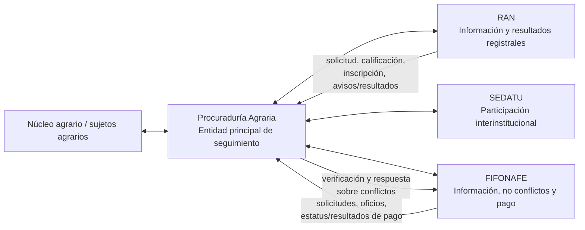

# CONTEXTO FUNCIONAL DE LIBERACIÓN EN PROPIEDAD SOCIAL — PROCURADURÍA AGRARIA

> **Propósito:** describir de forma estructurada el proceso de liberación en propiedad social, tomando a la Procuraduría Agraria (PA) como entidad principal de seguimiento e integrando el flujo, la estructura de datos y las reglas funcionales del proyecto.
>
> **Jerarquía documental:**
> 1. `Descripción proceso.md` — fuente funcional canónica del proyecto. Define el modelo objetivo, la jerarquía territorial, el momento de creación de la afectación, las rutas operativas, variantes de convenios, pagos, cierre y reglas de implementación funcional.
> 2. `flujo_liberacion_propiedad_social_fuente.md` — fuente de verdad para la reconstrucción del flujograma original: secuencia visual, bifurcaciones, rutas e instituciones participantes.
> 3. `estructura_datos_propiedad_social_fuente.md` — fuente de verdad para los bloques y campos visibles de seguimiento de derechos colectivos, derechos individuales, FIFONAFE y ORV.
> 4. `Conceptos.md` — definiciones de dominio y significado de conceptos y campos.
> 5. `CONVENIOS DE OCUPACIÓN PREVIA.md` e `Introducción agraria básica.md` — contexto jurídico y agrario complementario.
> 6. `Description.md` — descripción general del producto; sirve como visión de alto nivel y no prevalece sobre `Descripción proceso.md` cuando exista diferencia de detalle.
>
> **Reglas de precedencia:**
> - Para el **comportamiento funcional objetivo del sistema**, prevalece `Descripción proceso.md`.
> - Para comprobar **qué muestra literalmente el flujograma**, prevalece `flujo_liberacion_propiedad_social_fuente.md`.
> - Para comprobar **qué bloques y campos aparecen en la matriz de seguimiento**, prevalece `estructura_datos_propiedad_social_fuente.md`.
> - Las fuentes jurídicas y conceptuales complementan el significado, pero no deben utilizarse para reescribir silenciosamente una regla funcional canónica.
>
> **Límite de interpretación:** este documento integra las fuentes anteriores, pero no sustituye las transcripciones fuente cuando se necesita verificar un detalle literal ni reemplaza una validación jurídica cuando una regla dependa de normativa vigente.

---

## 1. Principio institucional de interpretación

La **Procuraduría Agraria es la entidad principal de seguimiento** del flujo descrito en este documento.

Esto **no significa** que la PA ejecute, genere o sea responsable exclusiva de todos los actos, documentos o datos que aparecen en el expediente.

El proceso requiere información, actuaciones o resultados provenientes de otras instituciones, principalmente:

- **RAN - Registro Agrario Nacional**: información registral, ingreso de documentos, números de solicitud, calificación registral, inscripción y avisos/resultados registrales.
- **SEDATU**: participa en distintas actividades del flujo según la leyenda del flujo, particularmente en investigación, negociación y determinados actos relacionados con el proceso.
- **FIFONAFE**: interviene en la etapa asociada con fondos comunes, solicitud de información, informe de no conflictos y pago de indemnización.

Por lo tanto, deben distinguirse siempre los siguientes tipos de participación:

1. **Actividad de la PA**: actuación en la que el flujo indica participación de PA.
2. **Actividad compartida**: actuación con participación de PA y una o más instituciones.
3. **Hito externo**: actuación o resultado necesario para continuar, pero sin participación de PA indicada en el flujo.
4. **Dato externo**: dato producido, emitido o confirmado por otra institución y utilizado por la PA para seguimiento.
5. **Registro de seguimiento**: información que el sistema de la PA conserva para saber el estado del expediente, sin que ello implique que la PA haya generado el dato original.

### Regla crítica

> **Que un dato exista dentro del sistema de la PA no implica que haya sido generado por la PA.**

Ejemplos:

- El sistema puede registrar un **número de solicitud de ingreso al RAN**, pero ese identificador pertenece al trámite ante el RAN.
- El sistema puede registrar la **calificación registral** o la **fecha de inscripción**, pero no debe inferirse que la PA realiza la función registral.
- El sistema puede registrar el **pago de indemnización**, pero el flujo atribuye el pago a FIFONAFE, no a PA.

---

## 1.1 Modelo territorial y expediente de seguimiento

La estructura funcional del proyecto es:

```text
Proyecto
└── Tramo
    └── Tramo_Núcleo
        └── Afectación
            ├── colectiva
            └── individual
```

Lectura funcional:

- `proyecto` agrupa los tramos de una obra ferroviaria.
- `tramo` es la unidad territorial utilizada para consulta, asignación y medición de avance.
- `tramo_nucleo` representa el cruce territorial y administrativo entre un tramo y un núcleo agrario y constituye el **expediente maestro territorial** de liberación.
- `afectacion` representa un derecho y una superficie confirmados y constituye un **subexpediente operativo** colectivo o individual.

Debe distinguirse el papel de dos conceptos que no compiten entre sí:

- **Núcleo agrario:** entidad agraria central alrededor de la cual se relacionan ejido/comunidad, representación, padrón, parcelas, derechos y documentación.
- **Tramo_Núcleo:** expediente maestro de un cruce concreto entre ese núcleo y un tramo dentro de un proyecto.

### Momento de creación de la afectación

La mera identificación del cruce `tramo_nucleo` no crea automáticamente una afectación.

La secuencia funcional es:

```text
Posible afectación
    ↓
Sensibilización
    ↓
Caminamiento
    ↓
Análisis territorial y jurídico
    ↓
Confirmación de derecho, superficie, geometría y sujetos
    ↓
Creación de afectacion
    ↓
Apertura del subexpediente colectivo o individual
```

Las actuaciones compartidas previas a la confirmación permanecen en `tramo_nucleo` y deben poder consultarse como antecedentes desde la afectación correspondiente.

### Regla geoespacial

La geometría debe conservar su referencia espacial y procedencia. Los insumos pueden llegar en distintos sistemas de coordenadas; el seguimiento debe permitir normalización controlada sin perder el SRC original. En particular, los mapas de consulta suelen trabajar en coordenadas geográficas y la documentación jurídica puede utilizar coordenadas UTM.

---

## 2. Alcance del flujo

El procedimiento se organiza en tres fases principales:

1. **Investigación**
2. **Negociación**
3. **Consolidación**

A partir de la negociación se distinguen dos rutas:

- **Derechos colectivos**
- **Derechos individuales**

El flujo fuente no presenta un símbolo explícito de Inicio ni de Fin. La primera actividad visible es:

> **Identificación de núcleos agrarios (NA) con posible afectación por el trazo ferroviario**

El cierre operativo visible es:

> **Pago de indemnización**

---

## 3. Leyenda institucional del flujo fuente

Los puntos de color del flujo indican participación institucional:

| Institución | Abreviatura | Color en el flujo |
|---|---|---|
| Procuraduría Agraria | PA | Verde |
| Registro Agrario Nacional | RAN | Rojo |
| SEDATU | SEDATU | Azul |
| FIFONAFE | FIFONAFE | Morado / magenta |

> La presencia de un punto indica participación institucional. No debe interpretarse automáticamente como responsabilidad exclusiva, salvo cuando el propio texto del nodo lo establezca claramente.

---

## 4. Flujo canónico de liberación

El siguiente Mermaid conserva la lógica principal del flujo fuente.

```mermaid
flowchart LR

  subgraph INV["Investigación"]
    direction TB
    I1["Identificación de núcleos agrarios (NA)<br/>con posible afectación por el trazo ferroviario"]
    I2["Análisis preliminar de afectaciones"]
    I3["Revisión de condiciones sociales, jurídicas,<br/>registrales, etc. del NA, incluyendo<br/>estatus de padrón y ORV"]
    I4["Acercamiento inicial"]
    I5["Reunión de sensibilización con ORV<br/>y actores relevantes"]
    I6["Caminamiento"]
    I7["Análisis de afectaciones"]
    I8["Identificación de predios a afectar<br/>y situación jurídica"]

    I1 --> I2 --> I3 --> I4 --> I5 --> I6 --> I7 --> I8
  end

  N0["Avalúo"]
  I8 --> N0

  subgraph COL["Negociación - Derechos colectivos"]
    direction TB
    C1["Apoyo en la emisión de Convocatorias y<br/>Actas de no Verificativo (en su caso)"]
    C2["Asamblea de Anuencia, para presentación del proyecto,<br/>superficie afectada y avalúo, asesoría del proceso<br/>expropiatorio y explicación del COP"]
    D1{"¿Existe anuencia?"}
    C3["Conciliación y replanteamiento del proyecto"]
    D2{"¿Existe acuerdo?"}
    C4["Valoración de expropiación directa"]
    C5["Apoyo y asesoría en la conformación del Acta<br/>de Asamblea y firma de COP colectivo(s)"]

    C1 --> C2 --> D1
    D1 -->|Sí| C5
    D1 -->|No| C3 --> D2
    D2 -->|Sí| C5
    D2 -->|No| C4
  end

  subgraph IND["Negociación - Derechos individuales"]
    direction TB
    D3["Asesoría del proceso expropiatorio y<br/>explicación del COP"]
    D4["Acompañamiento en la integración del expediente"]
    D5["Firma del COP"]
    D3 --> D4 --> D5
  end

  N0 --> C1
  N0 --> D3

  subgraph CC["Consolidación - Derechos colectivos"]
    direction LR
    CC1["Consolidación y gestión de los COP"]
    CC2["Ingreso al RAN del Acta de Asamblea y<br/>COP colectivo(s)"]
    CC3["Obtención del Aviso de Inscripción<br/>por parte del RAN"]
    CC4["Verificación de inscripción"]
    CC1 --> CC2 --> CC3 --> CC4
  end

  subgraph CI["Consolidación - Derechos individuales"]
    direction LR
    CI1["Consolidación y gestión de los COP"]
    CI2["Ingreso al RAN de COP individual(es)"]
    CI3["Obtención del Aviso de Inscripción<br/>por parte del RAN"]
    CI4["Verificación de inscripción"]
    CI1 --> CI2 --> CI3 --> CI4
  end

  C5 --> CC1
  D5 --> CI1

  P1["Integración de expedientes para el pago<br/>de indemnización"]
  P2["Asesoría y acompañamiento en el proceso<br/>de pago de fondos comunes"]
  P3["Recepción de solicitud de información para pago<br/>de indemnización, por parte del FIFONAFE"]
  P4["Verificación de información y de estatus<br/>de 'no conflictos'"]
  P5["Respuesta a FIFONAFE, sobre la existencia o no<br/>de conflictos, para pago de indemnización"]
  P6["Pago de indemnización"]

  P1 --> P2 --> P3 --> P4 --> P5 --> P6

  C5 --> P1
  D5 --> P1
  CC3 --> P1
  CI3 --> P1
```



### Nota sobre la convergencia hacia integración de expedientes para pago

La fuente visual muestra convergencias desde las rutas colectiva e individual y desde los avisos de inscripción hacia **Integración de expedientes para el pago de indemnización**. La línea vertical compartida entre las cajas de firma colectiva e individual es visualmente ambigua; no debe interpretarse como una regla de cambio de una ruta de derechos a la otra.

### Nota sobre la rama de expropiación directa

La reconstrucción del flujograma conserva que **Valoración de expropiación directa** no tiene una salida visible en la fuente original.

Para el comportamiento funcional del proyecto, `Descripción proceso.md` resuelve ese vacío: **expropiación directa** se registra como una salida terminal fuera del flujo ordinario de seguimiento de la PA. Conserva clasificación, antecedentes, observaciones, documentos y trazabilidad, pero no continúa por convenio, RAN, FIFONAFE y pago dentro de la ruta ordinaria.

La misma regla funcional se aplica a la condición de **comunidad indígena** cuando se clasifica como salida terminal del expediente operativo. Esta regla proviene de la descripción funcional canónica, no del flujograma simplificado.

---

## 5. Lectura del procedimiento desde la Procuraduría Agraria

La PA debe entenderse como el eje del seguimiento, no como el único ejecutor del proceso.

### 5.1 Investigación

Secuencia:

1. Identificación de núcleos agrarios con posible afectación.
2. Análisis preliminar de afectaciones.
3. Revisión de condiciones sociales, jurídicas y registrales, incluyendo padrón y ORV.
4. Acercamiento inicial.
5. Reunión de sensibilización con ORV y actores relevantes.
6. Caminamiento.
7. Análisis de afectaciones.
8. Identificación de predios a afectar y situación jurídica.
9. Avalúo como insumo previo a la negociación.

Participación institucional indicada en el flujo:

| Actividad | PA | RAN | SEDATU | FIFONAFE |
|---|:---:|:---:|:---:|:---:|
| Identificación de NA | ✓ | ✓ | ✓ | |
| Análisis preliminar | ✓ | ✓ | ✓ | |
| Revisión de condiciones sociales, jurídicas y registrales; padrón y ORV | ✓ | ✓ | | |
| Acercamiento inicial | ✓ | | | |
| Sensibilización | ✓ | ✓ | ✓ | |
| Caminamiento | ✓ | ✓ | ✓ | |
| Análisis de afectaciones | ✓ | ✓ | ✓ | |
| Identificación de predios y situación jurídica | ✓ | ✓ | ✓ | |
| Avalúo | | ✓ | ✓ | |

**Interpretación institucional:** el avalúo es necesario para continuar, pero el flujo no coloca participación de PA en ese nodo. No debe convertirse automáticamente en una actividad ejecutada por PA.

---

## 6. Ruta de derechos colectivos

### 6.1 Negociación colectiva

La ruta colectiva incluye:

1. Apoyo en emisión de convocatorias y Actas de no Verificativo, cuando corresponda.
2. Asamblea de Anuencia.
3. Decisión: **¿Existe anuencia?**
4. Si **Sí**: conformación del Acta de Asamblea y firma de COP colectivo(s).
5. Si **No**: conciliación y replanteamiento del proyecto.
6. Nueva decisión: **¿Existe acuerdo?**
7. Si **Sí**: regreso a conformación del Acta y firma de COP colectivo(s).
8. Si **No**: valoración de expropiación directa.

### 6.2 Seguimiento colectivo según `estructura_datos_propiedad_social_fuente.md`

La página de **Seguimiento de afectación a derechos colectivos** agrega bloques operativos de información que deben relacionarse con el flujo principal, sin sustituirlo:

- Datos generales.
- Identificación del tramo.
- Sensibilización.
- Caminamiento.
- Asamblea de anuencia y aprobación del Convenio de Ocupación Previa (COP) - inscripción.
- Convenio de Ocupación Previa - inscripción.
- Convenio modificatorio - inscripción.
- Sensibilización asociada a superficie adicional.
- Caminamiento asociado a superficie adicional.
- Asamblea de anuencia y aprobación de convenio de superficie adicional.
- Convenio de superficie adicional - inscripción.
- Sensibilización asociada a obras complementarias.
- Caminamiento asociado a obras complementarias.
- Asamblea de anuencia y aprobación de convenio de obras complementarias.
- Convenio de obras complementarias - inscripción.
- Indemnización.
- Escenarios especiales mostrados junto a la etapa de indemnización: expropiación directa, proyecto ferroviario que no afecta tierras de uso común y comunidad indígena.
- Informe de no conflictos.
- Soporte documental.

### 6.3 Datos generales colectivos

`estructura_datos_propiedad_social_fuente.md` incluye, entre otros:

- Entidad.
- Municipio.
- Residencia.
- Consecutivo.
- Núcleo agrario.
- E/C.
- Destino de la superficie.
- No. de parcela/solar.
- Fecha de padrón.
- Padrón: número de ejidatarios/comuneros.
- ORV vigentes (sí/no).
- Fecha de vencimiento de ORV.
- Acta de elección de ORV inscrita en el RAN (sí/no).
- Clave del tramo.
- Número de tramo.

### 6.4 Datos de sensibilización y caminamiento

Para los ciclos mostrados en la estructura de datos aparecen campos como:

- Reunión programada (fecha).
- Reunión realizada (fecha).
- Caminamiento programado (fecha).
- Caminamiento realizado (fecha).

Cuando existen **superficie adicional** u **obras complementarias**, `estructura_datos_propiedad_social_fuente.md` vuelve a incluir sensibilización y caminamiento. Esto debe entenderse como un seguimiento adicional asociado a esas variantes, no como una modificación automática del flujo general simplificado.

### 6.5 Datos de asamblea y convenio colectivo

Entre los campos visibles se encuentran:

- Asamblea programada, incluyendo primera y segunda convocatoria cuando aplica.
- Asamblea realizada.
- Convenio firmado (fecha).
- Monto del convenio al 90%.
- Monto del convenio al 100%.
- Monto BDT.
- Ingreso al RAN (fecha).
- Número de solicitud de ingreso.
- Calificación registral.
- Acta inscrita en el RAN (fecha).
- Convenio inscrito en el RAN (fecha).
- Superficie total real afectada (ha).

La estructura repite conceptos equivalentes para convenio modificatorio, superficie adicional y obras complementarias.

> **Importante:** el PDF de estructura contiene algunos nombres repetidos con sufijos numéricos o variantes tipográficas. Estos nombres se agrupan por significado funcional; los sufijos visibles no deben tomarse como nombres técnicos definitivos de campos de base de datos sin revisar la fuente correspondiente.

---

## 6.6 Reglas funcionales de convenios colectivos

Los tipos colectivos definidos funcionalmente son:

```text
cop_original
modificatorio
superficie_adicional
obras_complementarias
```

Reglas:

- **COP original:** sigue el ciclo ordinario de sensibilización/caminamiento, asamblea, firma, consolidación y seguimiento registral.
- **Modificatorio:** ajusta el convenio original y debe conservar su relación con éste.
- **Superficie adicional:** incorpora nueva superficie y abre un nuevo ciclo de sensibilización, caminamiento, asamblea, convenio y seguimiento ante el RAN.
- **Obras complementarias:** abre un ciclo propio de sensibilización, caminamiento, asamblea, convenio y seguimiento registral; no sustituye ni sobrescribe el COP original.
- Los ciclos repetidos deben representarse mediante registros relacionados y contexto de proceso, no mediante columnas duplicadas con sufijos técnicos artificiales.
- Para **obras complementarias**, la descripción funcional vigente establece que `monto_bdt` no aplica.

Estas reglas explican por qué la matriz de seguimiento contiene bloques repetidos de sensibilización, caminamiento, asamblea y convenio para superficie adicional y obras complementarias.

---

## 7. Ruta de derechos individuales

### 7.1 Negociación individual

El flujo fuente establece:

1. Asesoría del proceso expropiatorio y explicación del COP.
2. Acompañamiento en la integración del expediente.
3. Firma del COP.
4. Consolidación y gestión del COP.
5. Ingreso al RAN.
6. Obtención del Aviso de Inscripción.
7. Verificación de inscripción.

### 7.2 Seguimiento individual según `estructura_datos_propiedad_social_fuente.md`

La página de **Seguimiento de afectación a derechos individuales** organiza el seguimiento en:

- Datos generales.
- Identificación del tramo.
- Convenio de Ocupación Previa - inscripción.
- Convenio modificatorio - inscripción.
- Convenio ampliación - inscripción.
- Convenio ampliación - remanente.
- Soporte documental.

### 7.3 Datos generales individuales

Entre los campos visibles se encuentran:

- Entidad.
- Municipio.
- Residencia.
- Consecutivo.
- Núcleo agrario.
- E/C.
- Tipo de parcela (individual).
- No. de parcela PPT.
- Nombre de la persona titular de la parcela.
- Constancia de vigencia de derechos (fecha).
- Certificado parcelario.
- Folio de derechos.
- Clave del tramo.
- Número de tramo.

### 7.4 Datos de convenios e inscripción

Para el COP y sus variantes, la estructura contempla conceptos como:

- Fecha de convenio firmado.
- Fecha de convenio modificatorio.
- Fecha de convenio de ampliación.
- Fecha de convenio de ampliación/remanente.
- Monto 90%.
- Monto 100%.
- Monto BDT.
- Fecha de ingreso al RAN.
- Número de solicitud de ingreso.
- Calificación registral.
- Fecha de inscripción del convenio en el RAN.
- Superficie total (ha).
- Superficie de ampliación.
- Documentación disponible.
- Documentación faltante.

### Regla de interpretación

Las variantes **modificatorio**, **ampliación** y **remanente** aparecen en `estructura_datos_propiedad_social_fuente.md`, aunque no están desglosadas como ramas independientes en el flujo fuente simplificado. Deben tratarse como **subprocesos o extensiones de seguimiento** asociados a la ruta individual, sin reemplazar la lógica base del flujo.

---

## 7.5 Reglas funcionales de convenios individuales

Los tipos individuales definidos funcionalmente son:

```text
cop_original
modificatorio
ampliacion
ampliacion_remanente
```

Reglas:

- **COP original individual:** registra firma, superficie, valor de tierra, BDT y seguimiento registral.
- **Modificatorio individual:** ajusta fecha y montos; conforme a la regla funcional vigente no registra nueva superficie ni BDT y no requiere inscripción ante el RAN.
- **Ampliación** y **ampliación remanente:** registran nueva superficie, montos y el seguimiento registral correspondiente.
- La ruta individual se vincula con una parcela y al menos un titular activo; puede existir más de un titular mediante relaciones independientes.
- La negociación y firma del convenio individual se realiza con los titulares y no requiere una asamblea del núcleo para autorizar ese convenio individual.

---

## 8. Consolidación y dependencia con RAN

El flujo general muestra para derechos colectivos e individuales:

1. Consolidación y gestión de los COP.
2. Ingreso al RAN de la documentación correspondiente.
3. Obtención del Aviso de Inscripción por parte del RAN.
4. Verificación de inscripción.

### 8.1 Papel de la PA

La PA participa en el seguimiento de estas etapas según el flujo. Debe diferenciarse la gestión y seguimiento realizado por la PA de las actuaciones registrales propias del RAN.

### 8.2 Datos RAN que `estructura_datos_propiedad_social_fuente.md` requiere para seguimiento

Los bloques de derechos colectivos e individuales incluyen reiteradamente:

- Fecha de ingreso al RAN.
- Número de solicitud de ingreso.
- Calificación registral.
- Fecha de inscripción del acta, cuando corresponde.
- Fecha de inscripción del convenio.

Estos campos son un ejemplo claro de **datos externos necesarios dentro del seguimiento PA**.

### Regla de interpretación

No confundir:

```text
PA gestiona / presenta / da seguimiento / verifica
        ≠
RAN recibe / califica / inscribe / produce resultado registral
```

El sistema puede almacenar ambos lados de la relación para trazabilidad.

---

## 9. FIFONAFE, informe de no conflictos y pago

El flujo fuente establece la siguiente secuencia asociada al pago:

1. Integración de expedientes para el pago de indemnización.
2. Asesoría y acompañamiento en el proceso de pago de fondos comunes.
3. Recepción de solicitud de información para pago de indemnización por parte del FIFONAFE.
4. Verificación de información y estatus de "no conflictos".
5. Respuesta a FIFONAFE sobre la existencia o no de conflictos.
6. Pago de indemnización.

En el flujo:

- **Asesoría y acompañamiento en fondos comunes** muestra participación PA y FIFONAFE.
- **Recepción de solicitud de FIFONAFE** muestra participación PA y FIFONAFE.
- **Verificación de no conflictos** muestra participación PA.
- **Respuesta a FIFONAFE** muestra participación PA.
- **Pago de indemnización** muestra participación FIFONAFE.

### 9.1 Seguimiento FIFONAFE en `estructura_datos_propiedad_social_fuente.md`

La página específica de FIFONAFE separa:

#### Derechos colectivos

- Asamblea retiro de fondos.
- Informe de no conflictos.
- Estatus: completo, pendiente o programado.
- No. de oficio FIFONAFE a DGAOPR/Representación y fecha.
- No. de oficio DGAOPR a Representación y fecha.
- Respuesta de Representación a DGAOPR, número de oficio y fecha.
- Respuesta DGAOPR/Representación a FIFONAFE, número de oficio y fecha.

#### Derechos individuales

- Indemnización.
- Informe de no conflictos.
- Estatus: completo, pendiente o programado.
- No. de oficio FIFONAFE a DGAOPR/Representación y fecha.
- No. de oficio DGAOPR a Representación y fecha.
- Respuesta de Representación a DGAOPR, número de oficio y fecha.
- Respuesta DGAOPR/Representación a FIFONAFE, número de oficio y fecha.

### Regla de interpretación

La PA puede conservar y dar seguimiento a los intercambios de oficios y a la existencia/no existencia de conflictos, pero **el pago no debe atribuirse a PA** cuando la fuente principal lo asocia a FIFONAFE.

La estructura de seguimiento muestra un **estatus** para indemnización y/o retiro de fondos. No debe deducirse de esas matrices, por sí solas, que existan campos de fecha, monto, referencia bancaria o autorización si otra fuente no los define.

`Descripción proceso.md` sí define, para el modelo funcional del proyecto, un nivel de detalle adicional para pagos. Por ello, dentro del sistema objetivo pueden existir registros de pago con monto, fecha, tipo, medio, banco, referencia y beneficiario, siempre relacionados con el trámite FIFONAFE correspondiente.

### 9.2 Regla económica del convenio

La descripción funcional establece:

```text
valor de la tierra       = monto_100
anticipo de la tierra    = monto_90
bienes distintos tierra = monto_bdt
límite pagable           = monto_100 + monto_bdt
```

`monto_90` es un anticipo incluido dentro de `monto_100`; no debe sumarse nuevamente como un tercer concepto independiente.

Reglas adicionales:

- COP original colectivo o individual: `monto_100` y `monto_bdt` se registran de manera independiente, aunque BDT pueda ser cero.
- Ampliaciones: pueden aplicar valor de tierra y BDT.
- Obras complementarias: BDT no aplica conforme al modelo funcional vigente.
- La suma de pagos activos no debe exceder `monto_100 + monto_bdt`.


---

## 9.3 Cierre y condición de liberación

Para la ruta ordinaria, el estado de liberación no debe capturarse como una afirmación aislada; se deriva de los hitos que resulten aplicables:

```text
Convenio firmado
    ↓
Seguimiento registral ante el RAN
    ↓
Aviso y verificación de inscripción
    ↓
Informe de no conflictos
    ↓
Pago concluido
    ↓
Liberado
```

Cada hito debe conservarse por separado.

Un `tramo_nucleo` sólo puede considerarse liberado cuando todas sus afectaciones activas aplicables estén liberadas. Si combina afectaciones liberadas con salidas terminales, debe conservarse la condición mixta sin ocultar las afectaciones que quedaron fuera del flujo ordinario.

Las salidas por **expropiación directa** o **comunidad indígena** no equivalen a liberación dentro de esta ruta; se conservan como estados terminales fuera del seguimiento ordinario de convenio, RAN, FIFONAFE y pago.

---

## 10. ORV y padrón como información transversal

`estructura_datos_propiedad_social_fuente.md` contiene una página específica para **ORV**. Esta información se relaciona directamente con la etapa del flujo:

> **Revisión de condiciones sociales, jurídicas, registrales, etc. del NA, incluyendo estatus de padrón y ORV**

También es relevante para el acercamiento y la sensibilización con ORV y actores relevantes.

### 10.1 Datos generales ORV

- Núm.
- Entidad.
- Municipio.
- Núcleo agrario.
- E/C.

### 10.2 Órganos de representación y vigilancia

La estructura contempla:

- Comisariado - Presidente.
- Comisariado - Secretario.
- Comisariado - Tesorero.
- Consejo de Vigilancia - Presidente.
- Consejo de Vigilancia - Secretario 1.
- Consejo de Vigilancia - Secretario 2.
- Inicio de vigencia.
- Fin de vigencia.
- ORV vigentes (sí/no) / estatus.
- Acta de elección de ORV inscrita en el RAN (sí/no).

### 10.3 Padrón de ejidatarios/comuneros

- Fecha de padrón.
- Número de ejidatarios/comuneros.

### 10.4 Soporte documental

- Documentación disponible.
- Documentación faltante.

### 10.5 Observaciones

La estructura incluye el encabezado **OBSERVACIONES**, pero no define campos específicos debajo. No debe inferirse una estructura adicional únicamente a partir de ese encabezado.

### Regla de interpretación

ORV y padrón no deben modelarse conceptualmente como pasos aislados posteriores: son **información transversal de condición del núcleo agrario** utilizada durante investigación, acercamiento, sensibilización y preparación de actuaciones colectivas.

---

## 10.6 Complemento conceptual y jurídico

Las fuentes conceptuales y agrarias permiten interpretar los datos del seguimiento sin alterar la secuencia funcional.

### Instituciones

- **PA:** entidad principal del seguimiento y acompañamiento agrario.
- **RAN:** fuente y autoridad registral para ingreso, calificación, inscripción y resultados registrales.
- **SEDATU:** participa en el proceso expropiatorio y en actuaciones interinstitucionales señaladas en las fuentes.
- **FIFONAFE:** interviene en fondos comunes, cadena de oficios, indemnización y dispersión/pago según la ruta aplicable.

### Núcleo, órganos y sujetos

- Un núcleo agrario puede ser ejido o comunidad.
- La Asamblea es el órgano colectivo de decisión.
- El Comisariado representa al núcleo y ejecuta acuerdos.
- El Consejo de Vigilancia supervisa las actuaciones del Comisariado.
- Los sujetos agrarios incluyen ejidatarios, comuneros, avecindados y posesionarios según su calidad contextual.

### COP y expropiación

El Convenio de Ocupación Previa permite formalizar la ocupación mientras se tramita el proceso expropiatorio. En derechos colectivos, la ruta requiere actuaciones de asamblea; en derechos individuales, la firma se realiza directamente con el titular o titulares afectados.

El contexto jurídico complementario debe utilizarse como marco explicativo. Cuando una regla dependa de normativa vigente, prevalece la validación jurídica correspondiente y no una inferencia automática del modelo de datos.

---

## 11. Relación entre el flujo y la estructura de datos

| Momento del flujo | Información de seguimiento asociada | Fuente externa relevante | Lectura desde PA |
|---|---|---|---|
| Identificación del NA | Entidad, municipio, residencia, núcleo agrario, tramo | RAN / SEDATU según participación | PA concentra el expediente de seguimiento |
| Revisión de condiciones | Padrón, ORV, vigencias, acta inscrita | RAN y datos del núcleo | PA revisa y usa información para determinar condiciones |
| Sensibilización | Fecha programada y realizada | Participación interinstitucional | PA participa y da seguimiento |
| Caminamiento | Fecha programada y realizada | RAN / SEDATU según flujo | PA participa y conserva evidencia de avance |
| Asamblea colectiva | Convocatorias, fechas, asamblea realizada | Actores agrarios e instituciones participantes | PA apoya y asesora |
| Firma de COP | Fecha, montos, superficies | Partes e instituciones participantes | PA acompaña/gestiona según ruta |
| Ingreso al RAN | Fecha de ingreso, número de solicitud | RAN | Dato externo seguido por PA |
| Calificación / inscripción | Calificación, fechas de acta/convenio inscrito | RAN | Resultado registral externo incorporado al seguimiento |
| Informe de no conflictos | Oficios, respuestas, estatus | FIFONAFE / DGAOPR / Representación | PA verifica y responde según el flujo |
| Pago | Estatus / resultado de indemnización | FIFONAFE | PA puede dar seguimiento; no ejecuta el pago según el flujo |
| Soporte documental | Disponible / faltante | Varias fuentes | PA controla completitud del expediente de seguimiento |

---

## 11.1 Etiquetas, abreviaturas y normalización

La estructura de seguimiento contiene abreviaturas y sufijos que deben tratarse con cuidado.

Definiciones ya respaldadas por las fuentes de contexto:

- `BDT` = **Bienes Distintos a la Tierra**.
- `COP` = **Convenio de Ocupación Previa**.

Etiquetas que deben conservarse sin expansión técnica adicional mientras otra fuente no la establezca expresamente:

- `E/C`
- `PPT`
- `DGAOPR`

También aparecen sufijos visibles como `FECHA2`, `FECHA27`, `BDT25`, `INGRESO38`, `REGISTRAL210`, entre otros.

Reglas:

1. No usar esos sufijos visuales como nombres definitivos de columnas o propiedades.
2. No asignar una expansión a una abreviatura si las fuentes de contexto no la definen.
3. En la descripción funcional pueden normalizarse frases repetidas por significado, pero debe conservarse la trazabilidad hacia la etiqueta literal de `estructura_datos_propiedad_social_fuente.md`.
4. La presencia de un campo en la matriz significa que debe poder darse seguimiento a esa información; no determina por sí sola quién la genera ni cuándo se vuelve obligatoria.

---

## 12. Extensiones operativas que aparecen en `estructura_datos_propiedad_social_fuente.md`

`estructura_datos_propiedad_social_fuente.md` contiene conceptos que amplían el nivel de detalle del flujo fuente simplificado.

### Derechos colectivos

- Convenio modificatorio.
- Superficie adicional.
- Nuevos ciclos de sensibilización y caminamiento para superficie adicional.
- Asamblea para convenio de superficie adicional.
- Obras complementarias.
- Nuevos ciclos de sensibilización y caminamiento para obras complementarias.
- Asamblea para convenio de obras complementarias.
- Expropiación directa como escenario registrado.
- Proyecto ferroviario no afecta tierras de uso común.
- Comunidad indígena.

### Derechos individuales

- Convenio modificatorio.
- Convenio de ampliación.
- Convenio de ampliación - remanente.

### Interpretación obligatoria

Estas extensiones **no deben usarse para reescribir retroactivamente el flujo general**. Deben entenderse como mayor granularidad de seguimiento disponible en la estructura de datos.

Cuando sea necesario determinar si una de estas extensiones cambia realmente la secuencia del procedimiento, debe consultarse una fuente normativa o funcional adicional. No debe inferirse la relación únicamente a partir de la disposición visual de `estructura_datos_propiedad_social_fuente.md`.

---

## 13. Reglas de interpretación del flujo y del seguimiento

1. **PA es la entidad principal de referencia del sistema y del seguimiento.**
2. **PA no es el único actor del procedimiento.**
3. No atribuir a PA una actividad únicamente porque el dato correspondiente se almacene en su sistema.
4. Distinguir siempre entre **actividad**, **institución participante**, **institución fuente del dato**, **resultado externo** y **registro de seguimiento**.
5. Mantener las fases **Investigación → Negociación → Consolidación**.
6. Mantener separadas las rutas de **derechos colectivos** y **derechos individuales**.
7. Respetar las decisiones **¿Existe anuencia?** y **¿Existe acuerdo?**, incluyendo sus ramas Sí/No.
8. No inventar una salida para **Valoración de expropiación directa** con base únicamente en el flujo fuente disponible.
9. Considerar el **avalúo** como insumo necesario previo a las rutas de negociación; el flujo no indica participación de PA en ese nodo.
10. Considerar los datos de RAN como dependencias/resultado registral cuando correspondan, aunque se registren dentro del sistema PA.
11. Considerar FIFONAFE como institución externa indispensable en la etapa de solicitud de información, fondos comunes e indemnización.
12. No atribuir a PA la ejecución del **Pago de indemnización** cuando el flujo lo identifica con FIFONAFE.
13. Utilizar ORV y padrón como información transversal de condición del núcleo agrario.
14. Tratar **convenio modificatorio**, **superficie adicional**, **obras complementarias**, **ampliación** y **remanente** como extensiones operativas de seguimiento provenientes de `estructura_datos_propiedad_social_fuente.md`.
15. No convertir automáticamente esas extensiones en nuevas ramas del flujo canónico sin evidencia adicional.
16. Conservar trazabilidad documental: fechas, oficios, solicitudes, calificaciones, inscripciones y soporte disponible/faltante son parte del seguimiento.
17. Si una fuente externa genera un dato, conservar conceptualmente su procedencia aunque PA lo capture o consulte.
18. Ante contradicción sobre el flujo, usar como prioridad el flujo fuente.
19. Ante una necesidad de datos, consultar `estructura_datos_propiedad_social_fuente.md` como fuente complementaria.
20. No completar vacíos con suposiciones sobre responsabilidades institucionales.
21. La afectación se crea únicamente cuando estén confirmados el derecho afectado, superficie, geometría y sujetos; antes de ello el seguimiento permanece en `tramo_nucleo`.
22. `tramo_nucleo` es el expediente maestro territorial y `afectacion` el subexpediente operativo confirmado.
23. Las reglas funcionales de `Descripción proceso.md` prevalecen para el comportamiento objetivo del sistema cuando el flujograma simplificado no detalle una transición.
24. Las salidas por expropiación directa o comunidad indígena conservan trazabilidad, pero no continúan por la ruta ordinaria de convenio, RAN, FIFONAFE y pago.
25. El estado de liberación debe derivarse de hitos aplicables y no sustituirlos.
26. El modelo económico debe evitar sumar `monto_90` nuevamente sobre `monto_100`, porque el primero representa un anticipo incluido en el segundo.

---

## 14. Modelo conceptual de interacción institucional



> Este diagrama es una **síntesis de integración institucional**. No reemplaza el flujo canónico ni pretende asignar responsabilidades jurídicas no expresadas en las fuentes.

---

## 15. Ejemplos de interpretación institucional

### Caso A: número de solicitud de ingreso al RAN

**Incorrecto:**

> La PA genera el número de solicitud de ingreso.

**Correcto:**

> El seguimiento de PA necesita registrar el número de solicitud asociado al ingreso ante el RAN. La procedencia registral del dato debe conservarse.

### Caso B: calificación registral

**Incorrecto:**

> La PA califica registralmente el convenio.

**Correcto:**

> La calificación registral es un dato/resultante del trámite registral que PA necesita conocer y registrar para seguimiento.

### Caso C: informe de no conflictos

**Correcto:**

> El flujo coloca a PA en la verificación de información/estatus de no conflictos y en la respuesta a FIFONAFE. `estructura_datos_propiedad_social_fuente.md` agrega el seguimiento de oficios y respuestas entre FIFONAFE, DGAOPR/Representación y Representación.

### Caso D: pago de indemnización

**Incorrecto:**

> La PA ejecuta el pago.

**Correcto:**

> El flujo identifica el pago con FIFONAFE. PA puede necesitar registrar su estado o resultado para mantener trazabilidad del expediente.

### Caso E: convenio de ampliación o superficie adicional

**Incorrecto:**

> El flujo fuente obliga siempre a pasar por una ampliación después del COP.

**Correcto:**

> Las ampliaciones/superficies adicionales aparecen en la estructura de seguimiento, pero el flujo fuente no las establece como paso obligatorio para todos los casos. Deben activarse sólo cuando correspondan al expediente.

---

## 16. Criterios de consistencia del seguimiento

Para mantener consistencia entre el flujo y la estructura de seguimiento, deben revisarse por separado:

### A. Fidelidad del flujo

- ¿Se conserva Investigación → Negociación → Consolidación?
- ¿Se distinguen derechos colectivos e individuales?
- ¿Se conservan anuencia, conciliación y acuerdo?
- ¿Se representan correctamente las dependencias RAN y FIFONAFE?

### B. Fidelidad institucional

- ¿Se evita atribuir a PA actos externos?
- ¿Se conserva la institución fuente del dato?
- ¿Se distingue gestión/seguimiento de ejecución institucional?

### C. Cobertura de datos

- ¿Existen los datos generales necesarios?
- ¿Se puede registrar sensibilización y caminamiento?
- ¿Se puede dar seguimiento a asambleas y convenios?
- ¿Se puede registrar ingreso, solicitud, calificación e inscripción RAN?
- ¿Se contemplan ORV y padrón?
- ¿Se contemplan oficios y respuestas de FIFONAFE?
- ¿Se controla documentación disponible y faltante?
- ¿Se contemplan las variantes de convenios que aparecen en `estructura_datos_propiedad_social_fuente.md` cuando corresponda?

### D. Trazabilidad

Para cualquier dato proveniente de otra institución, el sistema debería poder distinguir al menos conceptualmente:

- qué dato es;
- de qué institución proviene;
- a qué expediente/afectación corresponde;
- cuándo se recibió o registró;
- cuál es su estado;
- qué documento o evidencia lo respalda.

> Este último bloque es un **criterio de diseño/auditoría derivado de la necesidad de trazabilidad**, no una transcripción literal de los PDFs.

---

## 17. Fuente de verdad y límites

### Fuente funcional canónica del proyecto

`Descripción proceso.md`

Define:

- jerarquía `Proyecto → Tramo → Tramo_Núcleo`;
- expediente maestro y subexpediente de afectación;
- momento de creación de la afectación;
- reglas colectivas e individuales;
- variantes de convenios;
- tratamiento funcional de salidas terminales;
- reglas económicas y pagos;
- condición de liberación;
- documentación, alertas y trazabilidad funcional.

### Fuente del flujo original

`flujo_liberacion_propiedad_social_fuente.md`

Se utiliza para:

- fases y secuencia visual;
- conexiones y bifurcaciones;
- derechos colectivos e individuales;
- participación institucional;
- relación visual con RAN y FIFONAFE;
- cierre visible en pago de indemnización.

### Fuente de estructura de seguimiento

`estructura_datos_propiedad_social_fuente.md`

Se utiliza para:

- campos de seguimiento colectivo;
- campos de seguimiento individual;
- variantes visibles de convenios;
- seguimiento registral relacionado con RAN;
- seguimiento de FIFONAFE;
- ORV y padrón;
- soporte documental.

### Fuentes complementarias

- `Conceptos.md`: definiciones de negocio, geometría y campos.
- `CONVENIOS DE OCUPACIÓN PREVIA.md`: contexto del COP y expropiación.
- `Introducción agraria básica.md`: conceptos agrarios e instituciones.
- `Description.md`: visión general del producto y sus componentes.

### Límites

- Los archivos fuente de flujo y estructura deben mantenerse fieles a los documentos originales y no incorporar decisiones del modelo del sistema.
- La descripción funcional puede resolver detalles no expresados por el flujograma simplificado, pero esas reglas deben conservarse identificadas como reglas del proyecto.
- La estructura de seguimiento no determina por sí sola cardinalidades, obligatoriedad ni orden causal.
- Los sufijos numéricos visibles no son identificadores técnicos canónicos.
- La presencia de un dato externo dentro del sistema de PA no transfiere a PA la responsabilidad institucional de generarlo.
- Las reglas jurídicas deben revisarse cuando cambie la normativa o antes de operar con datos reales.

---

## 18. Resumen operativo

```text
La PA es el centro institucional del seguimiento.

Modelo territorial:
Proyecto
  -> Tramo
    -> Tramo_Núcleo (expediente maestro)
      -> Afectación confirmada (subexpediente)
        -> colectiva | individual

Antes de crear Afectación:
identificación
  -> sensibilización
  -> caminamiento
  -> análisis
  -> confirmación de derecho/superficie/geometría/sujetos.

Flujo base de la fuente:
Investigación
  -> Negociación
    -> Consolidación
      -> RAN
        -> FIFONAFE / pago.

Ruta colectiva:
asamblea y COP
  -> variantes: original, modificatorio, superficie adicional,
     obras complementarias.

Ruta individual:
titular/parcela y COP
  -> variantes: original, modificatorio, ampliación,
     ampliación remanente.

RAN:
PA presenta/gestiona/da seguimiento.
RAN recibe/califica/inscribe y produce resultados registrales.

FIFONAFE:
PA verifica y responde sobre no conflictos.
FIFONAFE interviene en fondos e indemnización/pago según la ruta.

Pago:
monto_90 está incluido en monto_100.
límite pagable = monto_100 + monto_bdt.

Salidas terminales:
expropiación directa y comunidad indígena conservan trazabilidad,
pero no continúan por el flujo ordinario del sistema PA.

Liberación:
se deriva de los hitos aplicables; no sustituye convenio, RAN,
FIFONAFE ni pago.

ORV y padrón:
información transversal del núcleo agrario.

Las matrices de estructura agregan granularidad de seguimiento;
no reemplazan la secuencia funcional.
```
