# PROCEDIMIENTO GENERAL SIMPLIFICADO DE LIBERACIÓN EN PROPIEDAD SOCIAL

> **Naturaleza del documento:** reconstrucción estructurada del flujograma original.
>
> **Alcance:** conserva la secuencia, bifurcaciones, rutas de derechos colectivos e individuales y la participación institucional indicada visualmente.
>
> **Reglas de lectura:**
> - Este archivo es la fuente de verdad para el **orden y las conexiones del flujo**.
> - Los puntos institucionales se interpretan como participación indicada en la fuente, no como responsabilidad exclusiva salvo que el texto del propio nodo lo establezca.
> - No se agregan entidades de base de datos, pantallas, estados del sistema ni reglas de implementación.
> - Las cajas `Sí` y `No` se representan como etiquetas de conexiones para conservar la lógica de decisión.
> - La rama **Valoración de expropiación directa** no presenta una salida visible; no debe inventarse una continuación.
> - En la zona de convergencia hacia **Integración de expedientes para el pago de indemnización**, la geometría del conector vertical entre las rutas colectiva e individual es visualmente ambigua. La reconstrucción conserva las entradas hacia la integración de pago sin interpretarla como una transición funcional de derechos colectivos a derechos individuales.

---

## 1. Organización general del documento

El flujograma se organiza en tres fases principales:

1. **Investigación**
2. **Negociación**
3. **Consolidación**

Además, a partir de la negociación se distinguen dos ámbitos paralelos:

- **Derechos colectivos**
- **Derechos individuales**

El documento original no muestra símbolos explícitos de **Inicio** o **Fin**. La primera actividad visible es **“Identificación de núcleos agrarios (NA) con posible afectación por el trazo ferroviario”** y el cierre operativo del flujo principal es **“Pago de indemnización”**.

## 2. Leyenda institucional

Los puntos de color colocados junto a las actividades del flujograma indican participación institucional:

| Color en el PDF | Institución | Abreviatura usada en esta conversión |
|---|---|---|
| Verde | Procuraduría Agraria | PA |
| Rojo | Registro Agrario Nacional | RAN |
| Azul | SEDATU | SEDATU |
| Morado / magenta | FIFONAFE | FIFONAFE |

## 3. Flujograma reconstruido

```mermaid
flowchart LR

    %% =========================
    %% INVESTIGACIÓN
    %% =========================
    subgraph INV["Investigación"]
        direction TB

        I1["Identificación de núcleos agrarios (NA)<br/>con posible afectación por el trazo ferroviario"]
        I2["Análisis preliminar de afectaciones"]
        I3["Revisión de condiciones sociales, jurídicas,<br/>registrales, etc. del NA, incluyendo<br/>estatus de padrón y ORV"]
        I4["Acercamiento inicial"]
        I5["Reunión de sensibilización con ORV<br/>y actores relevantes"]
        I6["Caminamiento"]
        I7["Análisis de afectaciones"]
        I8["Identificación de predios a afectar<br/>y situación jurídica"]

        I1 --> I2
        I2 --> I3
        I3 --> I4
        I4 --> I5
        I5 --> I6
        I6 --> I7
        I7 --> I8
    end

    %% =========================
    %% NEGOCIACIÓN
    %% =========================
    subgraph NEG["Negociación"]
        direction TB

        N0["Avalúo"]

        subgraph NEG_COL["Derechos colectivos - negociación"]
            direction TB

            C1["Apoyo en la emisión de Convocatorias y<br/>Actas de no Verificativo (en su caso)"]
            C2["Asamblea de Anuencia, para presentación del proyecto,<br/>superficie afectada y avalúo, asesoría del proceso<br/>expropiatorio y explicación del COP"]
            D1{"¿Existe anuencia?"}
            C3["Conciliación y replanteamiento del proyecto"]
            D2{"¿Existe acuerdo?"}
            C4["Valoración de expropiación directa"]
            C5["Apoyo y asesoría en la conformación del Acta<br/>de Asamblea y firma de COP colectivo(s)"]

            C1 --> C2
            C2 --> D1
            D1 -->|No| C3
            C3 --> D2
            D1 -->|Sí| C5
            D2 -->|Sí| C5
            D2 -->|No| C4
        end

        subgraph NEG_IND["Derechos individuales - negociación"]
            direction TB

            D3["Asesoría del proceso expropiatorio y<br/>explicación del COP"]
            D4["Acompañamiento en la integración del expediente"]
            D5["Firma del COP"]

            D3 --> D4
            D4 --> D5
        end

        N0 --> C1
        N0 --> D3
    end

    I8 --> N0

    %% =========================
    %% CONSOLIDACIÓN
    %% =========================
    subgraph CONS["Consolidación"]
        direction TB

        subgraph CONS_COL["Derechos colectivos - consolidación"]
            direction LR

            CC1["Consolidación y gestión de los COP"]
            CC2["Ingreso al RAN del Acta de Asamblea y<br/>COP colectivo(s)"]
            CC3["Obtención del Aviso de Inscripción<br/>por parte del RAN"]
            CC4["Verificación de inscripción"]

            CC1 --> CC2
            CC2 --> CC3
            CC3 --> CC4
        end

        subgraph CONS_IND["Derechos individuales - consolidación"]
            direction LR

            CI1["Consolidación y gestión de los COP"]
            CI2["Ingreso al RAN de COP individual(es)"]
            CI3["Obtención del Aviso de Inscripción<br/>por parte del RAN"]
            CI4["Verificación de inscripción"]

            CI1 --> CI2
            CI2 --> CI3
            CI3 --> CI4
        end

        P1["Integración de expedientes para el pago<br/>de indemnización"]
        P2["Asesoría y acompañamiento en el proceso<br/>de pago de fondos comunes"]
        P3["Recepción de solicitud de información para pago<br/>de indemnización, por parte del FIFONAFE"]
        P4["Verificación de información y de estatus<br/>de “no conflictos”"]
        P5["Respuesta a FIFONAFE, sobre la existencia o no<br/>de conflictos, para pago de indemnización"]
        P6["Pago de indemnización"]

        P1 --> P2
        P2 --> P3
        P3 --> P4
        P4 --> P5
        P5 --> P6
    end

    %% Enlaces de negociación hacia consolidación
    C5 --> CC1
    D5 --> CI1

    %% Convergencias hacia integración de expedientes para pago
    C5 --> P1
    D5 --> P1
    CC3 --> P1
    CI3 --> P1

    %% =========================
    %% ESTILOS APROXIMADOS DEL PDF
    %% =========================
    classDef investigacion fill:#FBE3D6,stroke:#EF762F,color:#000,stroke-width:2px;
    classDef negociacion fill:#DCEAF7,stroke:#0070C0,color:#000,stroke-width:2px;
    classDef negociacionDestacada fill:#0B7FC7,stroke:#0B7FC7,color:#FFF,stroke-width:2px;
    classDef consolidacion fill:#E0ECD7,stroke:#1B6E2E,color:#000,stroke-width:2px;
    classDef consolidacionDestacada fill:#3D7F24,stroke:#1B6E2E,color:#FFF,stroke-width:2px;
    classDef decision fill:#DCEAF7,stroke:#0070C0,color:#000,stroke-width:2px;

    class I1,I2,I3,I4,I5,I6,I7,I8 investigacion;
    class N0,C1,C2,C3,C4,D3,D4,P1 negociacion;
    class C5,D5 negociacionDestacada;
    class D1,D2 decision;
    class CC1,CC2,CI1,CI2,P2,P3,P4,P5 consolidacion;
    class CC3,CC4,CI3,CI4,P6 consolidacionDestacada;

    style NEG_COL fill:#F8E3F6,stroke:#F8E3F6
    style NEG_IND fill:#F8E3F6,stroke:#F8E3F6
    style CONS_COL fill:#F8E3F6,stroke:#F8E3F6
    style CONS_IND fill:#F8E3F6,stroke:#F8E3F6
```

### Interpretación del flujo

La secuencia inicia con la identificación de núcleos agrarios potencialmente afectados y continúa con el análisis social, jurídico y territorial hasta identificar los predios a afectar y su situación jurídica. A continuación se realiza el **Avalúo**, punto desde el cual el flujo se divide en **derechos colectivos** y **derechos individuales**.

En derechos colectivos, el avalúo conduce al apoyo para convocatorias y actas, después a la Asamblea de Anuencia y a la decisión **“¿Existe anuencia?”**. Si la respuesta es **Sí**, se pasa al apoyo y asesoría para conformar el Acta de Asamblea y firmar COP colectivo(s). Si la respuesta es **No**, se realiza **Conciliación y replanteamiento del proyecto** y se evalúa **“¿Existe acuerdo?”**. Si existe acuerdo, el flujo converge nuevamente en la conformación del Acta y firma de COP colectivo(s); si no existe acuerdo, el documento conduce a **Valoración de expropiación directa**.

En derechos individuales, el avalúo conduce a la asesoría sobre el proceso expropiatorio y el COP, después al acompañamiento para integrar el expediente y finalmente a la **Firma del COP**.

En consolidación, las rutas colectiva e individual continúan con la gestión de COP, el ingreso de la documentación al RAN, la obtención del Aviso de Inscripción y la verificación de inscripción. El diagrama original también muestra que la **Integración de expedientes para el pago de indemnización** recibe conexiones desde cuatro puntos: la actividad de conformación y firma de COP colectivo(s), la Firma del COP individual, la obtención del Aviso de Inscripción de la ruta colectiva y la obtención del Aviso de Inscripción de la ruta individual.

Desde la integración de expedientes se continúa con la asesoría y acompañamiento para el pago de fondos comunes, la recepción de la solicitud de información del FIFONAFE, la verificación de información y del estatus de “no conflictos”, la respuesta al FIFONAFE y el **Pago de indemnización**.

## 4. Participación institucional indicada en el flujograma

`✓` significa que la fuente original coloca junto a esa actividad un punto del color correspondiente a la institución.

| Fase / ámbito | Actividad | PA | RAN | SEDATU | FIFONAFE |
|---|---|:---:|:---:|:---:|:---:|
| Investigación | Identificación de núcleos agrarios (NA) con posible afectación por el trazo ferroviario | ✓ | ✓ | ✓ | |
| Investigación | Análisis preliminar de afectaciones | ✓ | ✓ | ✓ | |
| Investigación | Revisión de condiciones sociales, jurídicas, registrales, etc. del NA, incluyendo estatus de padrón y ORV | ✓ | ✓ | | |
| Investigación | Acercamiento inicial | ✓ | | | |
| Investigación | Reunión de sensibilización con ORV y actores relevantes | ✓ | ✓ | ✓ | |
| Investigación | Caminamiento | ✓ | ✓ | ✓ | |
| Investigación | Análisis de afectaciones | ✓ | ✓ | ✓ | |
| Investigación | Identificación de predios a afectar y situación jurídica | ✓ | ✓ | ✓ | |
| Negociación / común | Avalúo | | ✓ | ✓ | |
| Negociación / derechos colectivos | Apoyo en la emisión de Convocatorias y Actas de no Verificativo (en su caso) | ✓ | | | |
| Negociación / derechos colectivos | Asamblea de Anuencia, para presentación del proyecto, superficie afectada y avalúo, asesoría del proceso expropiatorio y explicación del COP | ✓ | ✓ | ✓ | ✓ |
| Negociación / derechos colectivos | ¿Existe anuencia? | | | | |
| Negociación / derechos colectivos | Conciliación y replanteamiento del proyecto | ✓ | ✓ | ✓ | ✓ |
| Negociación / derechos colectivos | ¿Existe acuerdo? | | | | |
| Negociación / derechos colectivos | Valoración de expropiación directa | | | ✓ | |
| Negociación / derechos colectivos | Apoyo y asesoría en la conformación del Acta de Asamblea y firma de COP colectivo(s) | ✓ | | | |
| Negociación / derechos individuales | Asesoría del proceso expropiatorio y explicación del COP | ✓ | ✓ | ✓ | ✓ |
| Negociación / derechos individuales | Acompañamiento en la integración del expediente | ✓ | ✓ | ✓ | ✓ |
| Negociación / derechos individuales | Firma del COP | ✓ | ✓ | ✓ | ✓ |
| Consolidación / derechos colectivos | Consolidación y gestión de los COP | ✓ | | | |
| Consolidación / derechos colectivos | Ingreso al RAN del Acta de Asamblea y COP colectivo(s) | ✓ | | | |
| Consolidación / derechos colectivos | Obtención del Aviso de Inscripción por parte del RAN | ✓ | ✓ | | |
| Consolidación / derechos colectivos | Verificación de inscripción | ✓ | ✓ | | |
| Consolidación / derechos individuales | Consolidación y gestión de los COP | ✓ | | | |
| Consolidación / derechos individuales | Ingreso al RAN de COP individual(es) | ✓ | | | |
| Consolidación / derechos individuales | Obtención del Aviso de Inscripción por parte del RAN | ✓ | ✓ | | |
| Consolidación / derechos individuales | Verificación de inscripción | ✓ | ✓ | | |
| Consolidación / pago | Integración de expedientes para el pago de indemnización | | | | ✓ |
| Consolidación / pago | Asesoría y acompañamiento en el proceso de pago de fondos comunes | ✓ | | | ✓ |
| Consolidación / pago | Recepción de solicitud de información para pago de indemnización, por parte del FIFONAFE | ✓ | | | ✓ |
| Consolidación / pago | Verificación de información y de estatus de “no conflictos” | ✓ | | | |
| Consolidación / pago | Respuesta a FIFONAFE, sobre la existencia o no de conflictos, para pago de indemnización | ✓ | | | |
| Consolidación / pago | Pago de indemnización | | | | ✓ |

## 5. Relaciones y bifurcaciones críticas

| Origen | Condición / relación | Destino |
|---|---|---|
| Asamblea de Anuencia... | Flujo directo | ¿Existe anuencia? |
| ¿Existe anuencia? | **Sí** | Apoyo y asesoría en la conformación del Acta de Asamblea y firma de COP colectivo(s) |
| ¿Existe anuencia? | **No** | Conciliación y replanteamiento del proyecto |
| Conciliación y replanteamiento del proyecto | Flujo directo | ¿Existe acuerdo? |
| ¿Existe acuerdo? | **Sí** | Apoyo y asesoría en la conformación del Acta de Asamblea y firma de COP colectivo(s) |
| ¿Existe acuerdo? | **No** | Valoración de expropiación directa |
| Apoyo y asesoría en la conformación del Acta... | Convergencia adicional | Integración de expedientes para el pago de indemnización |
| Firma del COP | Convergencia adicional | Integración de expedientes para el pago de indemnización |
| Obtención del Aviso de Inscripción - derechos colectivos | Bifurcación | Verificación de inscripción **y** Integración de expedientes para el pago de indemnización |
| Obtención del Aviso de Inscripción - derechos individuales | Bifurcación | Verificación de inscripción **y** Integración de expedientes para el pago de indemnización |

## 6. Límites de interpretación

- Las fases canónicas son **Investigación → Negociación → Consolidación**.
- Desde la negociación se distinguen **derechos colectivos** y **derechos individuales**.
- El **Avalúo** es un nodo previo a la separación de ambas rutas.
- No se infiere un símbolo de Inicio o Fin que no exista en la fuente.
- No se asigna a la PA una actividad únicamente por estar representada dentro del flujo.
- Los actos y datos de RAN, SEDATU y FIFONAFE deben conservar su procedencia institucional.
- Este archivo no define campos de captura; para ello debe consultarse `estructura_datos_propiedad_social_fuente.md`.
